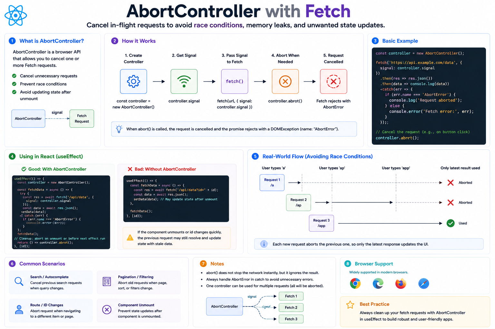

⚛️ **AbortController with Fetch in React**

Have you ever seen this happen?

1️⃣ A component starts an API request.

2️⃣ The user navigates away or changes the search query.

3️⃣ The old request finishes later and tries to update the UI.

This can lead to **stale data** and **race conditions**.

That's where **`AbortController`** comes in.

---

### What is `AbortController`?

It's a built-in browser API that lets you **cancel an ongoing request**.

Instead of waiting for an outdated response, you can stop the request entirely.

---

### Basic Example

```jsx id="abort01"
useEffect(() => {
  const controller = new AbortController();

  async function fetchUsers() {
    try {
      const res = await fetch(
        "/api/users",
        {
          signal: controller.signal,
        }
      );

      const data = await res.json();
      setUsers(data);
    } catch (err) {
      if (err.name !== "AbortError") {
        console.error(err);
      }
    }
  }

  fetchUsers();

  return () => controller.abort();
}, []);
```

---

### How it works

```text id="flow01"
Component Mounts
        ↓
Create AbortController
        ↓
Start Fetch Request
        ↓
User Leaves Page
or Dependencies Change
        ↓
Cleanup Runs
        ↓
controller.abort()
        ↓
Request Cancelled ✅
```

---

### Why is it useful?

✅ Prevents race conditions

✅ Avoids updating state from outdated requests

✅ Cancels unnecessary network requests

✅ Keeps your UI in sync with the latest user action

---

### Real-world example

Imagine a search box:

```text id="flow02"
User types:
"r"
 ↓
"re"
 ↓
"rea"
 ↓
"react"
```

Without cancellation:

```
Request 1 ───────────────►
Request 2 ─────────►
Request 3 ─────►
Request 4 ──►
```

An older request might finish last and overwrite newer results.

With `AbortController`:

```text id="flow03"
Request 1 ❌ Aborted
Request 2 ❌ Aborted
Request 3 ❌ Aborted
Request 4 ✅ Completed
```

Only the latest response updates the UI.

---

### 💡 Best Practices

✅ Create a new `AbortController` for each request.
✅ Pass `controller.signal` to `fetch()`.
✅ Call `controller.abort()` in the `useEffect` cleanup function.
✅ Ignore `AbortError` in the `catch` block—it's expected when a request is intentionally cancelled.

`AbortController` is a simple API, but it's one of the easiest ways to make your React applications more reliable when working with asynchronous data.

Have you used `AbortController` in your projects, or do you still rely on letting requests finish naturally?


