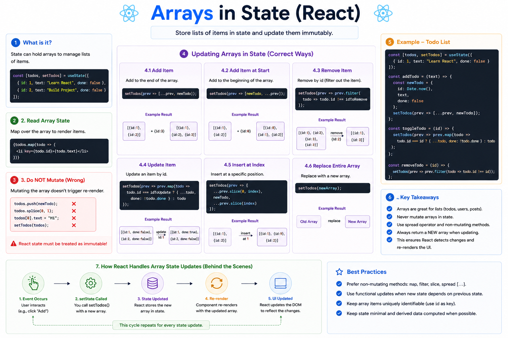

⚛️ **Arrays in React State Explained**

Lists are everywhere in React:

🛒 Shopping carts
📝 Todo lists
💬 Comments
👥 Users
📦 Products

That's why knowing how to manage **arrays in state** is essential.

### Creating an array state

```jsx id="arr01"
const [todos, setTodos] = useState([
  { id: 1, text: "Learn React" },
  { id: 2, text: "Build a Project" },
]);
```

---

### ✅ Add a new item

```jsx id="add01"
setTodos(prev => [
  ...prev,
  { id: 3, text: "Deploy App" },
]);
```

---

### ✅ Remove an item

```jsx id="remove01"
setTodos(prev =>
  prev.filter(todo => todo.id !== 2)
);
```

---

### ✅ Update an item

```jsx id="update01"
setTodos(prev =>
  prev.map(todo =>
    todo.id === 2
      ? { ...todo, text: "Build Portfolio" }
      : todo
  )
);
```

---

### ❌ Don't mutate the array

Avoid this:

```jsx id="bad01"
todos.push(newTodo);
setTodos(todos);
```

or

```jsx id="bad02"
todos.splice(0, 1);
```

These methods **mutate** the original array, making it harder for React to detect changes correctly.

---

### 💡 Think in terms of new arrays

```text id="flow01"
Old Array
    ↓
Create a New Array
    ↓
setState(newArray)
    ↓
React Re-renders
    ↓
Updated UI
```

React works best when you treat state as **immutable**.

---

### Best methods for array updates

✅ Add → `...spread`

```jsx id="best01"
[...prev, newItem]
```

✅ Remove → `filter()`

```jsx id="best02"
prev.filter(...)
```

✅ Update → `map()`

```jsx id="best03"
prev.map(...)
```

✅ Reorder or copy → `slice()` + spread

---

### Rule of Thumb

Never modify the existing array.

Always create a **new array** and pass it to the state setter.

This helps React efficiently detect changes and update only what’s necessary.

What's your go-to method for updating arrays in React—`map()`, `filter()`, or the spread operator?


