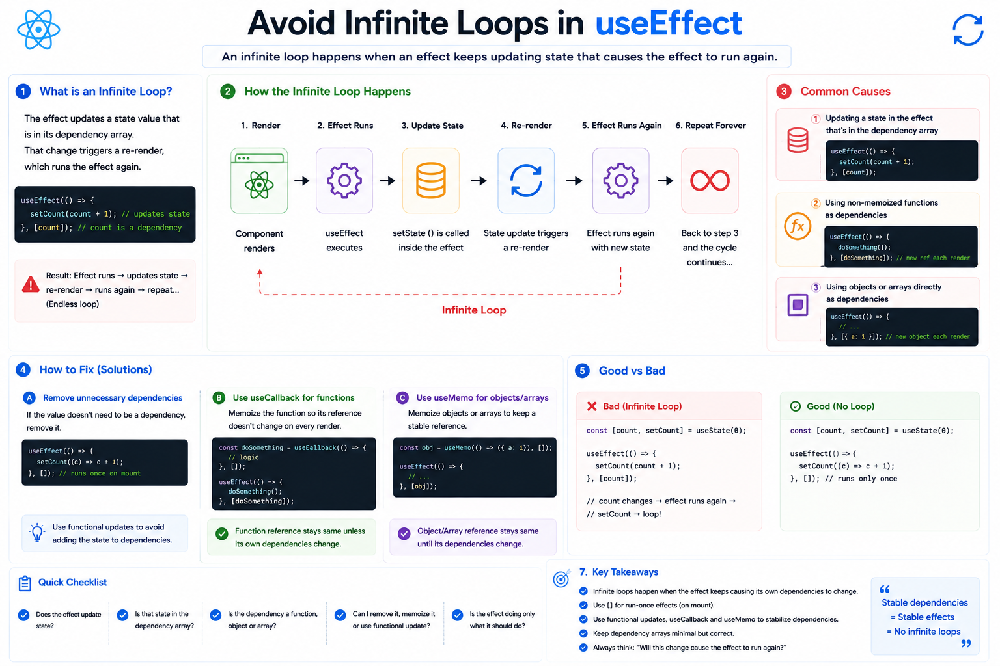

⚛️ **Avoid Infinite Loops in `useEffect`**

One of the most frustrating bugs in React is the **infinite `useEffect` loop**.

It usually happens when an effect keeps triggering itself.

### Here's the cycle 👇

```text id="flow01"
Component Renders
        ↓
useEffect Runs
        ↓
State Updates
        ↓
Component Re-renders
        ↓
useEffect Runs Again
        ↓
🔁 Repeat Forever
```

---

### ❌ Common Mistake #1

Updating a state that's also a dependency.

```jsx id="bad01"
useEffect(() => {
  setCount(count + 1);
}, [count]);
```

What happens?

* `count` changes
* Effect runs
* `count` changes again
* Effect runs again...

Infinite loop.

---

### ✅ Fix

If you only need to initialize the state once:

```jsx id="good01"
useEffect(() => {
  setCount(c => c + 1);
}, []);
```

The empty dependency array ensures the effect runs only after the initial render.

---

### ❌ Common Mistake #2

Using unstable functions as dependencies.

```jsx id="bad02"
function fetchData() {
  // ...
}

useEffect(() => {
  fetchData();
}, [fetchData]);
```

A new `fetchData` function is created on every render, so React sees the dependency as changed each time.

✅ If the function truly needs to be a dependency, memoize it with `useCallback` or move the logic directly into the effect when appropriate.

---

### ❌ Common Mistake #3

Using new objects or arrays as dependencies.

```jsx id="bad03"
useEffect(() => {
  // ...
}, [{ page: 1 }]);
```

Every render creates a new object reference, so the effect runs again.

Use stable references (or `useMemo` when appropriate) instead.

---

### 💡 Quick Checklist

Before writing a `useEffect`, ask yourself:

✅ Does this effect update state?
✅ Is that state listed as a dependency?
✅ Am I passing a new object, array, or function every render?
✅ Can this logic run during render instead of inside `useEffect`?

---

### Rule of Thumb

A `useEffect` should **react to changes**, not continuously create the changes that trigger itself.

Think of it like this:

```text id="rule01"
Stable Dependencies
        ↓
Predictable Effects
        ↓
No Infinite Loops ✅
```

The more stable your dependencies are, the more predictable your effects become.

Have you ever spent hours debugging an infinite `useEffect` loop? 😅


