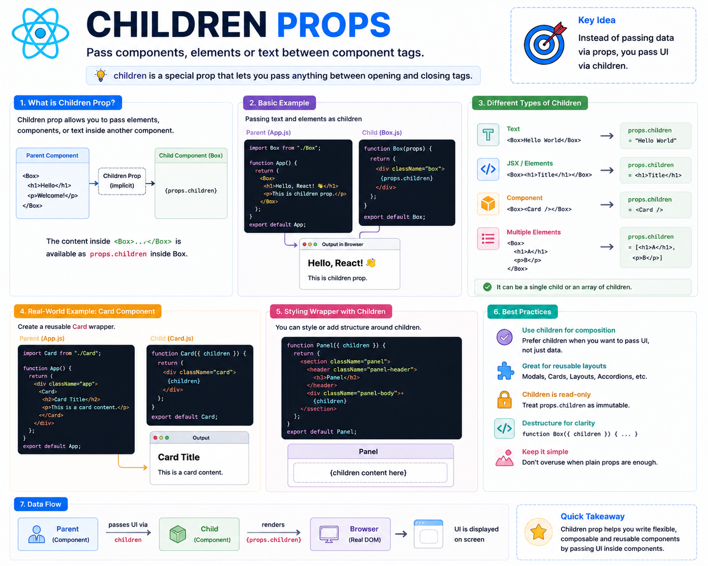

🧩 **React `children` Prop Explained**

Not every prop needs to be passed like this:

```jsx id="child01"
<Card title="React Basics" />
```

Sometimes you want to pass **entire UI** instead of simple values.

That's where the **`children` prop** comes in.

Example:

```jsx id="child02"
<Card>
  <h2>React Basics</h2>
  <p>Learn component composition.</p>
</Card>
```

Inside the `Card` component:

```jsx id="child03"
function Card({ children }) {
  return (
    <div className="card">
      {children}
    </div>
  );
}
```

Output:

```text id="child04"
+----------------------+
| React Basics         |
| Learn component...   |
+----------------------+
```

The content between `<Card>` and `</Card>` is automatically available as `children`.

Why use `children`?

✅ Build reusable wrapper components
✅ Create flexible layouts
✅ Pass JSX, text, or even other components
✅ Keep components clean and composable

You'll commonly see it in components like:

* `<Modal>`
* `<Card>`
* `<Layout>`
* `<Sidebar>`
* `<Button>`
* `<Tooltip>`

**Key takeaway:**

Regular props pass **data**.

The `children` prop passes **UI**.

It's one of the most powerful patterns in React for building reusable and composable components.

The diagram below shows how `children` flows from a parent component into a reusable wrapper. 👇

#React #ReactJS #JavaScript #Frontend #WebDevelopment #Programming #Coding #ReactTips


