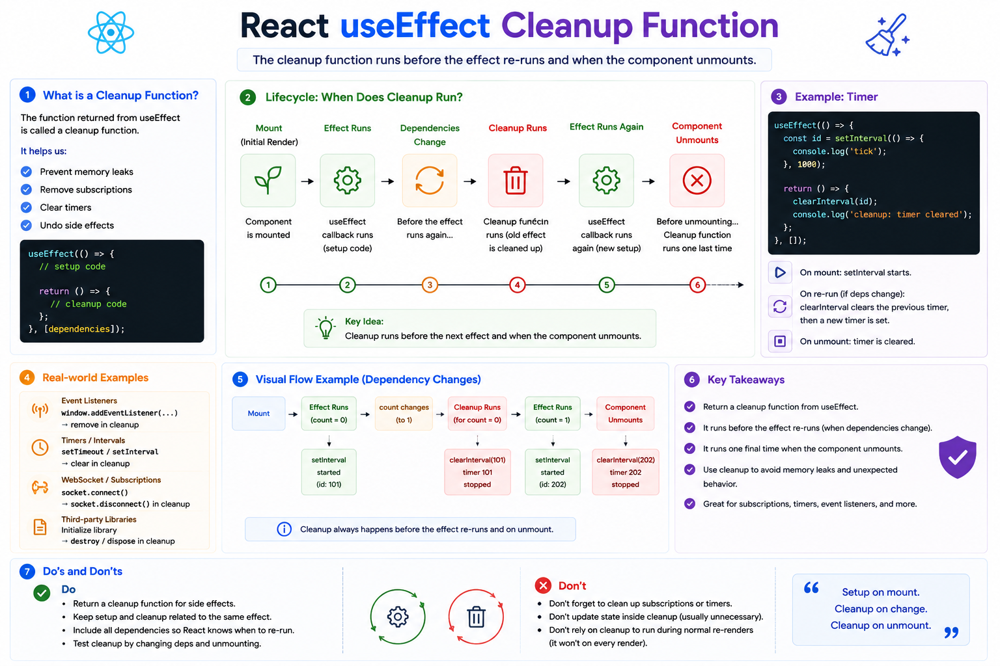

⚛️ **React `useEffect` Cleanup Function Explained**

One of the most overlooked parts of `useEffect` is the **cleanup function**.

It's what keeps your app from leaking memory, creating duplicate event listeners, or leaving timers running in the background.

### Basic Syntax

```jsx id="cleanup01"
useEffect(() => {
  // Setup

  return () => {
    // Cleanup
  };
}, [dependencies]);
```

The function returned from `useEffect` is called the **cleanup function**.

---

### When does cleanup run?

```text id="flow01"
Component Mounts
        ↓
Effect Runs
        ↓
Dependencies Change
        ↓
Cleanup Runs
        ↓
New Effect Runs
        ↓
Component Unmounts
        ↓
Cleanup Runs Again
```

React always cleans up the **previous effect** before running a new one, and performs one final cleanup when the component unmounts.

---

### Example: Timer

```jsx id="timer01"
useEffect(() => {
  const id = setInterval(() => {
    console.log("Tick");
  }, 1000);

  return () => {
    clearInterval(id);
  };
}, []);
```

Without cleanup:

❌ The timer keeps running even after the component is removed.

With cleanup:

✅ The timer is stopped automatically.

---

### Example: Event Listener

```jsx id="event01"
useEffect(() => {
  window.addEventListener("resize", handleResize);

  return () => {
    window.removeEventListener(
      "resize",
      handleResize
    );
  };
}, []);
```

This prevents duplicate listeners and avoids unnecessary work.

---

### Example: WebSocket

```jsx id="socket01"
useEffect(() => {
  socket.connect();

  return () => {
    socket.disconnect();
  };
}, []);
```

Always close external connections when they're no longer needed.

---

### Why is cleanup important?

✅ Prevents memory leaks

✅ Removes event listeners

✅ Stops timers and intervals

✅ Closes subscriptions and WebSocket connections

✅ Keeps your application predictable

---

### 💡 Rule of Thumb

If your effect **creates something**, it should usually **clean it up**.

Create:

```text id="rule01"
Timer
Listener
Subscription
Connection
```

Clean up:

```text id="rule02"
clearInterval()
removeEventListener()
unsubscribe()
disconnect()
```

Think of `useEffect` as having two phases:

**Setup** ➜ Create the side effect

**Cleanup** ➜ Remove the side effect

Understanding cleanup is essential for building performant React applications that don't leave background work running after a component is gone.

What's the first cleanup function you learned to write—`clearInterval`, `removeEventListener`, or something else?


