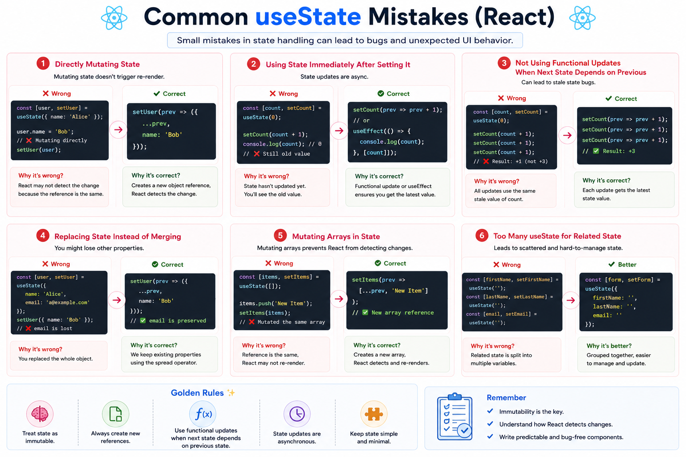

Here's a copy-paste-ready X post:

⚛️ **7 Common `useState` Mistakes Every React Developer Should Avoid**

`useState` looks simple, but a few small mistakes can lead to confusing bugs and unexpected UI behavior.

Here are the ones you'll see most often 👇

### 1️⃣ Mutating state directly ❌

```jsx id="mistake01"
user.name = "Alex";
```

✅ Instead:

```jsx id="fix01"
setUser(prev => ({
  ...prev,
  name: "Alex",
}));
```

React needs a **new object reference** to detect changes.

---

### 2️⃣ Reading state immediately after updating it ❌

```jsx id="mistake02"
setCount(count + 1);

console.log(count); // Still the old value
```

State updates are **asynchronous** and processed on the next render.

---

### 3️⃣ Not using functional updates when needed ❌

```jsx id="mistake03"
setCount(count + 1);
setCount(count + 1);
```

✅ Use:

```jsx id="fix02"
setCount(prev => prev + 1);
setCount(prev => prev + 1);
```

When the next state depends on the previous state, always use the functional form.

---

### 4️⃣ Replacing an object instead of updating it ❌

```jsx id="mistake04"
setUser({
  name: "Alex",
});
```

This removes the other properties.

✅

```jsx id="fix03"
setUser(prev => ({
  ...prev,
  name: "Alex",
}));
```

---

### 5️⃣ Mutating arrays ❌

```jsx id="mistake05"
todos.push(newTodo);
```

✅

```jsx id="fix04"
setTodos(prev => [...prev, newTodo]);
```

Always create a **new array** instead of modifying the existing one.

---

### 6️⃣ Using too many unrelated state updates

Instead of scattering related values everywhere:

```jsx id="mistake06"
const [firstName, setFirstName] = useState("");
const [lastName, setLastName] = useState("");
const [email, setEmail] = useState("");
```

If the values belong together, consider grouping them:

```jsx id="fix05"
const [form, setForm] = useState({
  firstName: "",
  lastName: "",
  email: "",
});
```

Choose the structure that best matches how your data changes.

---

### 7️⃣ Forgetting that React replaces object state

Unlike class components, `useState` **does not merge objects automatically**.

Always preserve existing properties with the spread operator when updating part of an object.

---

### 💡 Golden Rules

✅ Treat state as immutable
✅ Never mutate objects or arrays directly
✅ Use functional updates when the next state depends on the previous one
✅ Create new objects and arrays instead of modifying existing ones
✅ Group related state logically to keep components easier to maintain

Master these habits early, and you'll write more predictable, bug-free React components.

Which `useState` mistake has caught you off guard the most?

