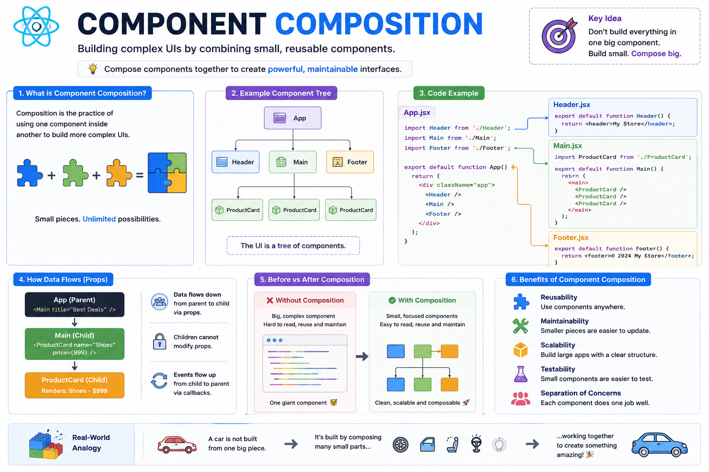

🧩 **Component Composition Explained**

One of React's biggest superpowers isn't Hooks or JSX...

It's **Component Composition**.

Instead of building one massive component, React encourages you to build many small components and combine them like LEGO blocks.

For example:

```jsx id="comp01"
function App() {
  return (
    <>
      <Header />
      <Sidebar />
      <MainContent />
      <Footer />
    </>
  );
}
```

Each component has a single responsibility:

```
App
├── Header
├── Sidebar
├── MainContent
│   ├── ProductList
│   │   ├── ProductCard
│   │   ├── ProductCard
│   │   └── ProductCard
│   └── Cart
└── Footer
```

Why composition matters:

✅ Reuse components across multiple pages
✅ Keep files small and focused
✅ Easier to test and debug
✅ Scale large applications without creating "God components"

Data typically flows like this:

📤 Parent → Child through **props**
📥 Child → Parent through callback functions

Think of it this way:

❌ One huge component trying to do everything.

✅ Many small components working together to build a complete UI.

**Key takeaway:**

Don't build bigger components.

Build **smaller components that compose together**. That's the mindset behind scalable React applications.

The diagram below shows how component composition creates clean, maintainable, and reusable React apps. 👇

#React #ReactJS #JavaScript #Frontend #WebDevelopment #Programming #Coding #SoftwareArchitecture


