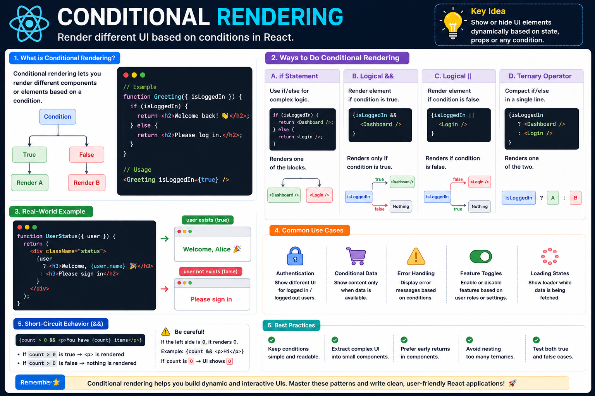

🔀 **Conditional Rendering in React Explained**

Not every user should see the same UI.

That's why React has **Conditional Rendering**.

It lets you show or hide elements based on state, props, or any condition.

Here are the most common patterns 👇

### 1️⃣ `if...else`

Best for complex logic.

```jsx id="cond01"
if (isLoggedIn) {
  return <Dashboard />;
}

return <Login />;
```

### 2️⃣ Ternary Operator (`? :`)

Perfect when choosing between two UI elements.

```jsx id="cond02"
return isLoggedIn
  ? <Dashboard />
  : <Login />;
```

### 3️⃣ Logical AND (`&&`)

Render something only when the condition is true.

```jsx id="cond03"
{isAdmin && <AdminPanel />}
```

### 4️⃣ Logical OR (`||`)

Provide a fallback value.

```jsx id="cond04"
const username = user.name || "Guest";
```

Real-world examples:

✅ Show Login / Logout button
✅ Display loading spinner while fetching data
✅ Show "No Results" when a list is empty
✅ Restrict admin-only features
✅ Display error messages only when needed

⚠️ Common mistake:

```jsx id="cond05"
{count && <Badge />}
```

If `count` is `0`, React renders `0` instead of nothing.

A safer approach:

```jsx id="cond06"
{count > 0 && <Badge />}
```

**Key takeaway:**

Conditional rendering is what makes React apps dynamic.

Instead of manually manipulating the DOM, you simply describe **what the UI should look like for each state**, and React handles the rest.

The diagram below summarizes the most common conditional rendering patterns you'll use every day. 👇

#React #ReactJS #JavaScript #Frontend #WebDevelopment #Programming #Coding #ReactTips


