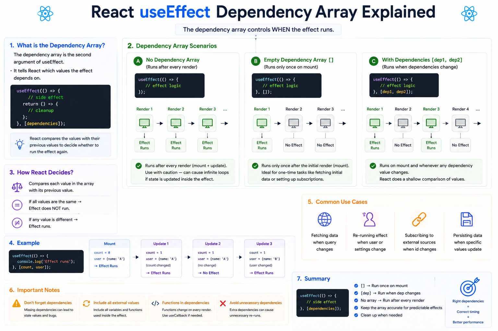

⚛️ **React `useEffect` Dependency Array Explained**

The second argument to `useEffect` controls **when your effect runs**.

Understanding it is the key to avoiding unnecessary re-renders, stale data, and infinite loops.

### 1️⃣ No Dependency Array

```jsx id="dep01"
useEffect(() => {
  console.log("Effect runs");
});
```

**Runs after every render.**

```text id="flow01"
Render
   ↓
Effect
   ↓
Render
   ↓
Effect
   ↓
...
```

Use this sparingly—it's easy to create unnecessary work or accidental loops.

---

### 2️⃣ Empty Dependency Array `[]`

```jsx id="dep02"
useEffect(() => {
  fetchData();
}, []);
```

**Runs only once**, after the initial render.

```text id="flow02"
Mount
   ↓
Effect ✅
   ↓
Re-render
   ↓
No Effect
```

Perfect for:

* Fetching initial data
* Setting up subscriptions
* Initializing third-party libraries

---

### 3️⃣ Specific Dependencies

```jsx id="dep03"
useEffect(() => {
  document.title = count;
}, [count]);
```

Now the effect runs only when `count` changes.

```text id="flow03"
count changes ✅
      ↓
Effect runs

name changes ❌
      ↓
No effect
```

React compares each dependency with its previous value. If any dependency changes, the effect runs again.

---

### A real-world example

```jsx id="example01"
useEffect(() => {
  fetchProducts(category);
}, [category]);
```

Whenever `category` changes:

```text id="flow04"
User selects category
        ↓
category updates
        ↓
Effect runs
        ↓
New products fetched
```

---

### Common Mistake 🚨

Forgetting a dependency:

```jsx id="bad01"
useEffect(() => {
  console.log(count);
}, []);
```

The effect only sees the initial value of `count`, which can lead to stale data and confusing bugs.

---

### 💡 Best Practices

✅ Include every value your effect uses in the dependency array.
✅ Use `[]` only for effects that should run once after mount.
✅ Skip the dependency array only when you intentionally want the effect after every render.
✅ If adding a function causes unnecessary re-runs, consider memoizing it with `useCallback` if appropriate.

Think of the dependency array as a **watch list**:

> "React, rerun this effect whenever **these values change**."

Mastering dependency arrays will make your effects more predictable, efficient, and easier to debug.

Which dependency array pattern do you use the most: **no array**, `[]`, or `[value]`?


