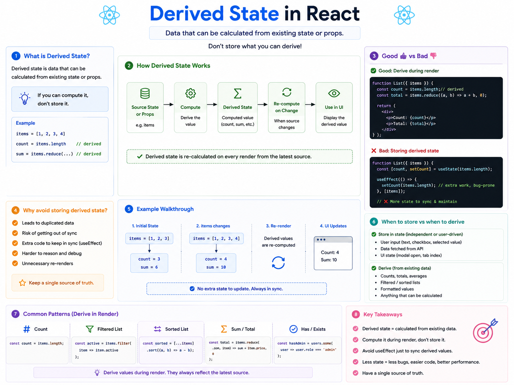

⚛️ **Derived State in React: Don't Store What You Can Calculate**

One of the biggest React best practices is:

> **If you can derive it, don't store it in state.**

Keeping unnecessary state leads to extra code, synchronization issues, and bugs.

### ❌ Bad Example

Imagine you already have a list of products:

```jsx id="bad01"
const [products, setProducts] = useState([...]);
const [productCount, setProductCount] = useState(0);

useEffect(() => {
  setProductCount(products.length);
}, [products]);
```

`productCount` is completely derived from `products`.

You're maintaining the same information in two places.

---

### ✅ Better Approach

Calculate it during render.

```jsx id="good01"
const [products, setProducts] = useState([...]);

const productCount = products.length;
```

Now there's only **one source of truth**.

Whenever `products` changes, `productCount` updates automatically.

---

### More examples of derived state

```jsx id="example01"
const completedTodos = todos.filter(
  todo => todo.completed
);

const totalPrice = cart.reduce(
  (sum, item) => sum + item.price,
  0
);

const hasAdmin = users.some(
  user => user.role === "admin"
);
```

These values don't need their own `useState`.

They can always be computed from existing data.

---

### Why avoid storing derived state?

❌ Duplicate data

❌ Extra `useEffect` just to keep values in sync

❌ Risk of inconsistent state

❌ More code to maintain

---

### When should data be in state?

Store data that changes independently, such as:

✅ User input

```jsx id="state01"
const [name, setName] = useState("");
```

✅ API responses

```jsx id="state02"
const [users, setUsers] = useState([]);
```

✅ UI state

```jsx id="state03"
const [isModalOpen, setIsModalOpen] = useState(false);
```

---

### Rule of Thumb

📦 Store:

* User-entered data
* API data
* UI state

🧮 Derive:

* Counts
* Totals
* Filtered lists
* Sorted lists
* Boolean checks
* Calculated values

---

### 💡 Key Takeaway

Every extra piece of state is another thing you have to keep in sync.

The less state you store, the simpler your components become.

**Keep one source of truth and derive everything else whenever possible.**

Do you usually store calculated values in state, or derive them during render?


