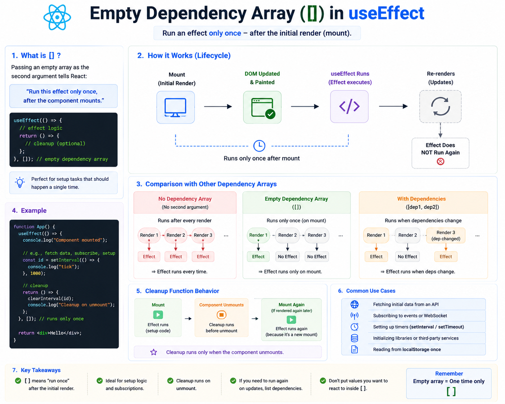

⚛️ **React `useEffect([])` Explained**

One of the most common patterns you'll see in React is:

```jsx id="empty01"
useEffect(() => {
  // Your code
}, []);
```

But what does the empty dependency array (`[]`) actually do?

### ✅ It tells React:

> "Run this effect **only once**, after the component is first rendered."

### Behind the scenes

```text id="flow01"
Component Mounts
        ↓
React renders UI
        ↓
DOM updates
        ↓
useEffect runs ✅
        ↓
Future re-renders
        ↓
Effect does NOT run again
```

The effect executes after the initial render and won't run again unless the component unmounts and mounts as a new instance.

---

### Common use cases

🌐 Fetch initial data

```jsx id="fetch01"
useEffect(() => {
  fetchUsers();
}, []);
```

---

⏰ Start a timer

```jsx id="timer01"
useEffect(() => {
  const id = setInterval(updateClock, 1000);

  return () => clearInterval(id);
}, []);
```

---

🎧 Add an event listener

```jsx id="listener01"
useEffect(() => {
  window.addEventListener("resize", handleResize);

  return () => {
    window.removeEventListener("resize", handleResize);
  };
}, []);
```

Always return a cleanup function for subscriptions, timers, and event listeners.

---

### Comparing dependency arrays

**No dependency array**

```jsx id="compare01"
useEffect(() => {});
```

➡️ Runs after **every render**

---

**Empty dependency array**

```jsx id="compare02"
useEffect(() => {}, []);
```

➡️ Runs **once** after the initial render

---

**Specific dependencies**

```jsx id="compare03"
useEffect(() => {}, [count]);
```

➡️ Runs after the initial render **and** whenever `count` changes

---

### ⚠️ Common mistake

Using `[]` when your effect depends on changing values:

```jsx id="bad01"
useEffect(() => {
  console.log(count);
}, []);
```

This logs only the initial value of `count`.

If your effect should respond to updates, include the dependency:

```jsx id="good01"
useEffect(() => {
  console.log(count);
}, [count]);
```

---

### 💡 Rule of Thumb

Use `useEffect([], ...)` for **one-time setup**, such as:

✅ Fetching initial data
✅ Setting up timers
✅ Registering event listeners
✅ Initializing third-party libraries

If your effect relies on values that can change, add those values to the dependency array.

Understanding the empty dependency array is the first step toward writing predictable and efficient React effects.

What's the first thing you usually put inside `useEffect([])`—an API call, a timer, or something else?


