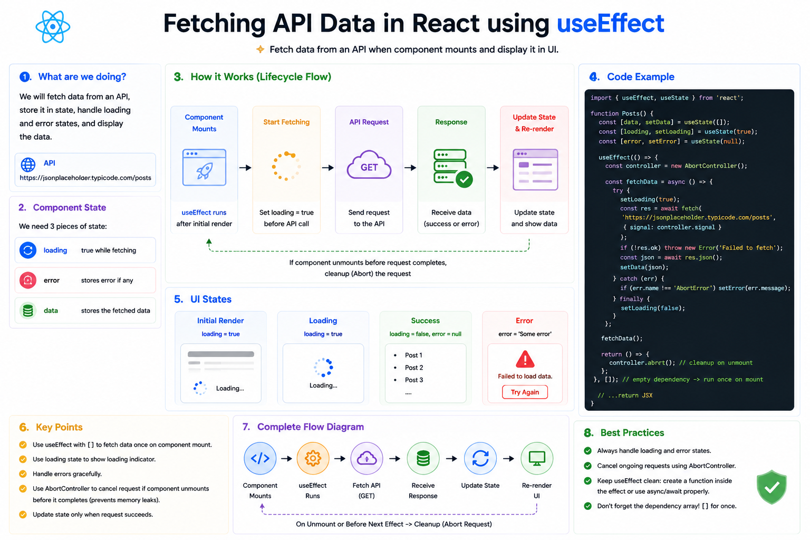

⚛️ **Fetching API Data in React with `useEffect`**

One of the most common uses of `useEffect` is fetching data from an API.

The typical flow looks like this:

```text id="flow01"
Component Mounts
        ↓
useEffect Runs
        ↓
API Request Sent
        ↓
Loading...
        ↓
Response Received
        ↓
Update State
        ↓
Component Re-renders
```

---

### Step 1: Create state

```jsx id="state01"
const [users, setUsers] = useState([]);
const [loading, setLoading] = useState(true);
const [error, setError] = useState(null);
```

We keep track of:

* 📦 Data
* ⏳ Loading state
* ❌ Error state

---

### Step 2: Fetch data

```jsx id="fetch01"
useEffect(() => {
  async function fetchUsers() {
    try {
      const res = await fetch(
        "https://jsonplaceholder.typicode.com/users"
      );

      if (!res.ok) {
        throw new Error("Request failed");
      }

      const data = await res.json();
      setUsers(data);
    } catch (err) {
      setError(err.message);
    } finally {
      setLoading(false);
    }
  }

  fetchUsers();
}, []);
```

The empty dependency array (`[]`) means the request runs **once after the initial render**.

---

### Step 3: Render different UI states

```jsx id="ui01"
if (loading) return <p>Loading...</p>;

if (error) return <p>{error}</p>;

return users.map(user => (
  <p key={user.id}>{user.name}</p>
));
```

A good user experience always handles:

✅ Loading

✅ Success

✅ Error

---

### Don't forget cleanup

If a request may still be in progress when the component unmounts, cancel it to avoid updating state after the component is gone.

```jsx id="cleanup01"
useEffect(() => {
  const controller = new AbortController();

  fetch(url, {
    signal: controller.signal,
  });

  return () => controller.abort();
}, []);
```

Using `AbortController` helps prevent unnecessary work and avoids race conditions when a component is removed before the request completes.

---

### 💡 Best Practices

✅ Fetch data inside `useEffect` for client-side requests.
✅ Track loading, success, and error states separately.
✅ Check `response.ok` before parsing JSON.
✅ Cancel long-running requests when appropriate.
✅ Keep your effect focused on one responsibility.

Fetching data isn't just about calling `fetch()`—it's about handling every stage of the request lifecycle so your UI stays predictable and responsive.

What's your preferred way to fetch data in React: **Fetch API**, **Axios**, or **TanStack Query**?

