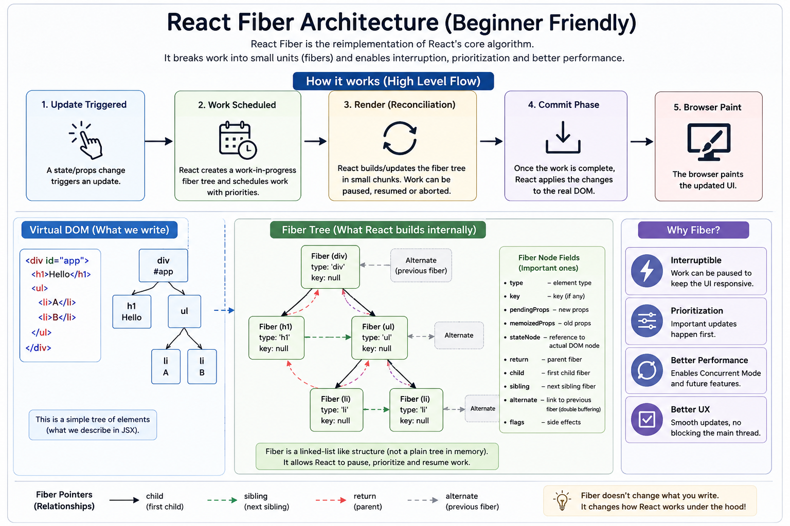

🚀 **React Fiber Architecture (Beginner Friendly)**

Ever wondered how React keeps your UI smooth, even during complex updates?

The answer is **React Fiber**.

Think of Fiber as React's smarter rendering engine.

Instead of processing the entire UI in one go, Fiber breaks rendering into **small units of work**.

This allows React to:
✅ Pause work if needed
✅ Prioritize important updates
✅ Resume rendering later
✅ Keep the UI responsive

**High-level flow:**

🔹 State/Props Change
⬇️
🔹 Work is Scheduled
⬇️
🔹 Reconciliation (Build/Update Fiber Tree)
⬇️
🔹 Commit Changes to the DOM
⬇️
🔹 Browser Paints the Updated UI

A simple example:

```jsx
function App() {
  const [count, setCount] = useState(0);

  return (
    <button onClick={() => setCount(count + 1)}>
      Count: {count}
    </button>
  );
}
```

When `count` changes, React **doesn't immediately update the DOM**.

Instead, Fiber:
• Creates work for the update
• Determines what actually changed
• Prioritizes the task
• Commits only the necessary DOM updates

💡 **Why does Fiber matter?**

• Faster rendering
• Smoother user interactions
• Better handling of large component trees
• Foundation for features like Concurrent Rendering, Suspense, and Transitions

React Fiber doesn't change how you write components—it changes **how React works behind the scenes** to make your apps feel faster.

What's the next React internals topic you'd like to explore—**Reconciliation**, **Concurrent Rendering**, or the **Commit Phase**?


