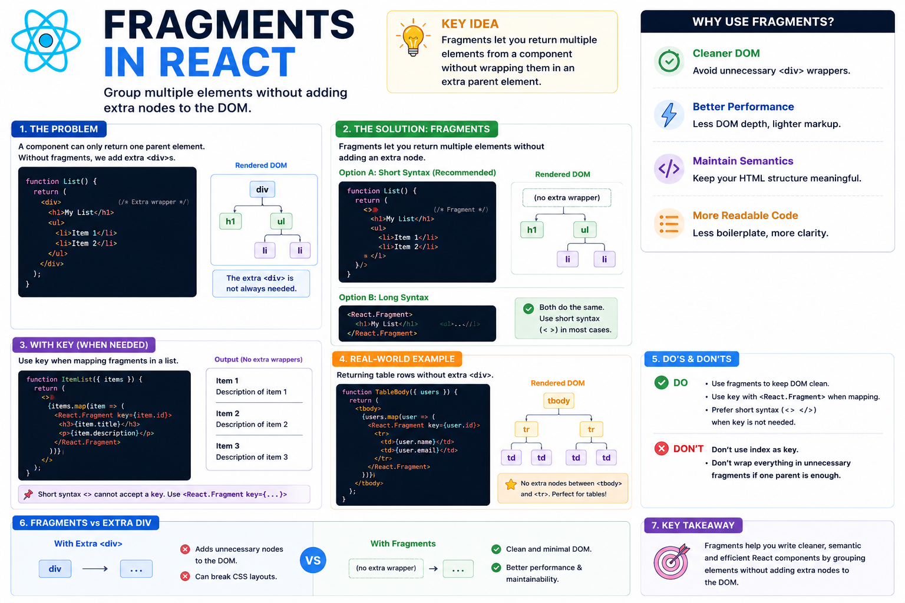

🧩 **React Fragments Explained**

Have you ever written this just to satisfy React?

```jsx
return (
  <div>
    <h1>Welcome</h1>
    <p>Learning React</p>
  </div>
);
```

What if that `<div>` isn't actually needed?

That's where **React Fragments** come in.

Instead of adding an unnecessary wrapper element, you can write:

```jsx
return (
  <>
    <h1>Welcome</h1>
    <p>Learning React</p>
  </>
);
```

Both examples render the same UI.

But the second one **doesn't add an extra DOM node**.

### Why use Fragments?

✅ Keep the DOM clean
✅ Avoid unnecessary `<div>` wrappers
✅ Prevent CSS/layout issues caused by extra elements
✅ Write more semantic HTML

### Two ways to use Fragments

Short syntax (most common):

```jsx
<>
  <Header />
  <Main />
</>
```

Long syntax (when you need a `key`):

```jsx
<React.Fragment key={item.id}>
  <Title />
  <Description />
</React.Fragment>
```

⚠️ The shorthand `<>...</>` **cannot** accept a `key`.

### When are Fragments useful?

• Table rows (`<tr>`, `<td>`)
• Lists of grouped elements
• Layout components
• Any time you need multiple sibling elements without an extra wrapper

**Key takeaway:**

Fragments don't change what users see.

They simply let you return multiple elements while keeping your DOM cleaner, lighter, and easier to maintain.

The diagram below shows when to use Fragments and why they're better than unnecessary wrapper `<div>` elements. 👇

#React #ReactJS #JavaScript #Frontend #WebDevelopment #Programming #Coding #ReactTips


