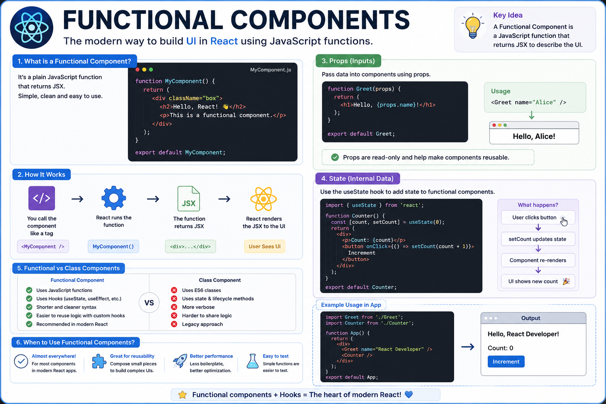

⚛️ **Functional Components Explained**

Modern React is built around **Functional Components**.

If you're starting React today, this is the component type you'll use almost everywhere.

A functional component is simply a JavaScript function that returns JSX.

```jsx id="fcomp01"
function Welcome() {
  return <h1>Hello, React!</h1>;
}
```

You can also pass data using **props**:

```jsx id="fcomp02"
function Welcome({ name }) {
  return <h1>Hello, {name}!</h1>;
}
```

Use it like this:

```jsx id="fcomp03"
<Welcome name="Swarup" />
```

With **Hooks**, functional components can also manage state:

```jsx id="fcomp04"
const [count, setCount] = useState(0);
```

This means one component can:

✅ Display UI
✅ Receive data through props
✅ Manage its own state
✅ Respond to user interactions
✅ Re-render automatically when state changes

Why functional components are the standard today:

• Less boilerplate
• Easier to read and maintain
• Hooks make state and side effects simple
• Great for reusable UI
• Recommended for all new React projects

**Key takeaway:**

A functional component is just a JavaScript function, but when combined with JSX and Hooks, it becomes the foundation of every modern React application.

The diagram below walks through the complete lifecycle of a functional component. 👇

#React #ReactJS #JavaScript #Frontend #WebDevelopment #Programming #Coding #Hooks


