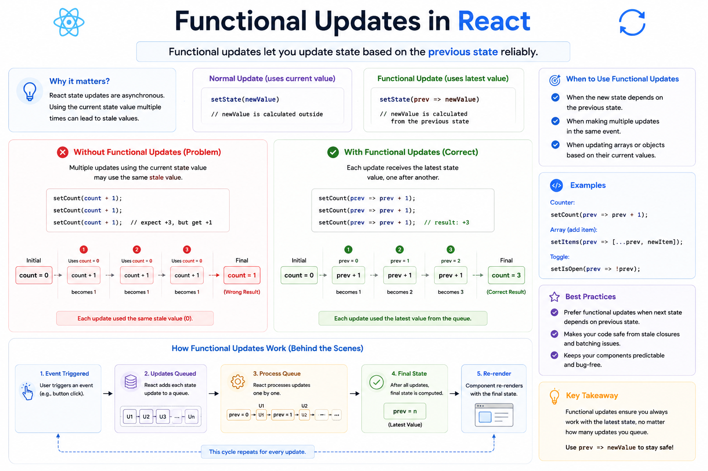

⚛️ **React Functional Updates Explained**

Have you ever written this?

```jsx id="bad01"
setCount(count + 1);
setCount(count + 1);
setCount(count + 1);
```

You expected the count to increase by **3**...

But it only increased by **1**. 🤔

Here's why 👇

React batches state updates, so each call above uses the **same stale value** of `count`.

If `count` is `0`, React sees:

```text
0 + 1
0 + 1
0 + 1
```

Result:

```text
count = 1
```

---

### ✅ The correct way: Functional Updates

Instead of passing the next value, pass a function.

```jsx id="good01"
setCount(prev => prev + 1);
setCount(prev => prev + 1);
setCount(prev => prev + 1);
```

Now React processes them one by one:

```text
0 → 1
1 → 2
2 → 3
```

Final result:

```text
count = 3 ✅
```

---

### Why does this work?

`prev` is always the **latest state value** available when React processes each update.

That means every update builds on the previous one instead of using an outdated value.

---

### When should you use functional updates?

✅ Increment/decrement counters

```jsx id="ex01"
setCount(prev => prev + 1);
```

✅ Toggle values

```jsx id="ex02"
setIsOpen(prev => !prev);
```

✅ Update arrays

```jsx id="ex03"
setTodos(prev => [...prev, newTodo]);
```

✅ Update objects

```jsx id="ex04"
setUser(prev => ({
  ...prev,
  age: prev.age + 1,
}));
```

---

### Rule of Thumb

Use:

```jsx id="rule01"
setState(newValue);
```

when you already know the next value.

Use:

```jsx id="rule02"
setState(prev => /* calculate next value */);
```

when the next state depends on the previous one.

💡 Functional updates make your components more predictable and prevent bugs caused by stale state.

Once you understand this pattern, React state management becomes much easier.

Have functional updates ever saved you from a tricky React bug?


