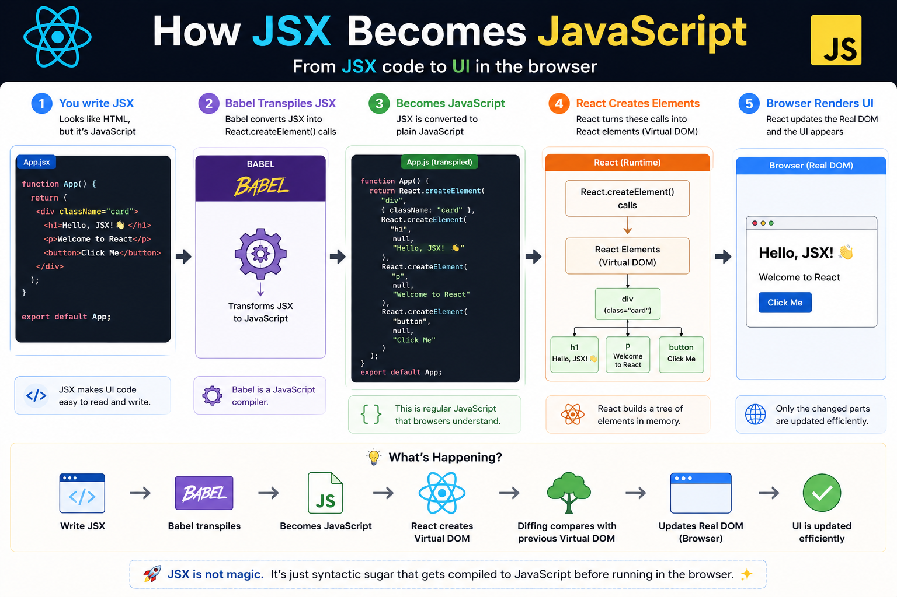

⚛️ **How JSX Becomes JavaScript**

A common misconception:

> "Browsers understand JSX."

They don't.

Browsers only understand **JavaScript**.

So what actually happens when you write this?

```jsx
function App() {
  return <h1>Hello, React!</h1>;
}
```

Here's the journey 👇

1️⃣ You write **JSX** (HTML-like syntax).

2️⃣ **Babel** transpiles it into plain JavaScript.

```js
React.createElement("h1", null, "Hello, React!")
```

3️⃣ React uses these `createElement()` calls to build a **Virtual DOM** tree.

4️⃣ When your state changes, React compares the old and new Virtual DOM (Diffing).

5️⃣ Finally, React updates **only the changed parts** of the Real DOM.

Why this matters:

✅ You get clean, readable code with JSX.
✅ Browsers receive plain JavaScript they can execute.
✅ React handles efficient UI updates behind the scenes.

**Key takeaway:**

JSX is just developer-friendly syntax.

It never reaches the browser directly—it's compiled into JavaScript during the build process.

The diagram below shows the complete flow from JSX → Babel → JavaScript → Virtual DOM → Browser. 👇

#React #ReactJS #JavaScript #JSX #Frontend #WebDevelopment #Programming #Coding


