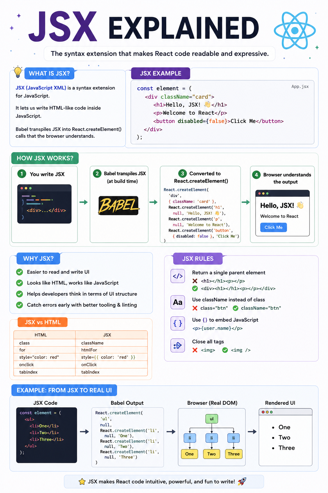

⚛️ **JSX Explained in 60 Seconds**

If you're learning React, you've probably written code like this:

```jsx
function App() {
  return <h1>Hello, React!</h1>;
}
```

It looks like HTML...

But it's actually **JSX**.

Here's what's happening behind the scenes 👇

🔹 JSX is a syntax extension for JavaScript.

🔹 It lets you write HTML-like code inside JavaScript, making UI code easier to read and maintain.

🔹 Browsers **don't understand JSX** directly.

Before your app runs, tools like **Babel** transform JSX into regular JavaScript.

For example:

```jsx
<h1>Hello</h1>
```

becomes:

```js
React.createElement("h1", null, "Hello")
```

Why developers love JSX:

✅ More readable than nested `createElement()` calls
✅ JavaScript and UI in one place
✅ Easy to embed dynamic values with `{}`
✅ Helps build reusable components

Some JSX rules to remember:

• Return a single parent element
• Use `className` instead of `class`
• Close all tags
• Write JavaScript inside `{}`

**Key takeaway:**

JSX isn't HTML.

It's a developer-friendly syntax that gets compiled into JavaScript before your code reaches the browser.

The diagram below shows the complete JSX → Babel → React → Browser flow. 👇

#React #ReactJS #JavaScript #Frontend #WebDevelopment #Programming #Coding #JSX


