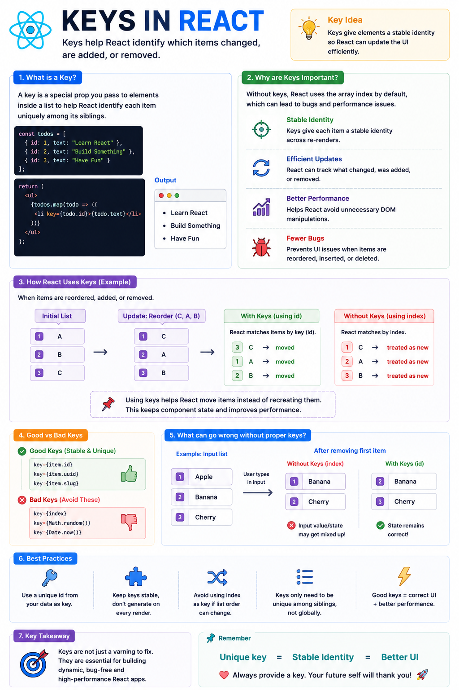

🔑 **Keys in React Explained**

If you've ever seen this warning...

> "Each child in a list should have a unique 'key' prop."

Don't ignore it.

Keys are one of the most important concepts in React.

Every time you render a list, React uses **keys** to identify which items:

✅ Stayed the same
✅ Changed
✅ Were added
✅ Were removed

Example:

```jsx id="key01"
const users = [
  { id: 1, name: "Alice" },
  { id: 2, name: "Bob" },
];

return (
  <ul>
    {users.map((user) => (
      <li key={user.id}>{user.name}</li>
    ))}
  </ul>
);
```

### Why not use the array index?

```jsx id="key02"
// ❌ Avoid this
items.map((item, index) => (
  <Item key={index} />
));
```

Imagine this list:

```text id="key03"
1. Apple
2. Banana
3. Cherry
```

Now remove **Apple**.

If you're using the index as the key, React may think:

❌ Banana is Apple
❌ Cherry is Banana

This can cause:

• Incorrect UI updates
• Lost input values
• Broken animations
• Unexpected bugs

Instead, use a stable unique ID:

```jsx id="key04"
<Item key={item.id} />
```

### Best practices

✅ Use database IDs or UUIDs
✅ Keys only need to be unique among siblings
✅ Keep keys stable between renders
❌ Don't use `Math.random()` or `Date.now()` as keys

**Key takeaway:**

Keys aren't just there to remove a warning.

They help React efficiently match old and new elements, making updates faster, preserving component state, and preventing subtle UI bugs.

The diagram below shows exactly how React uses keys during list updates. 👇

#React #ReactJS #JavaScript #Frontend #WebDevelopment #Programming #Coding #ReactTips

