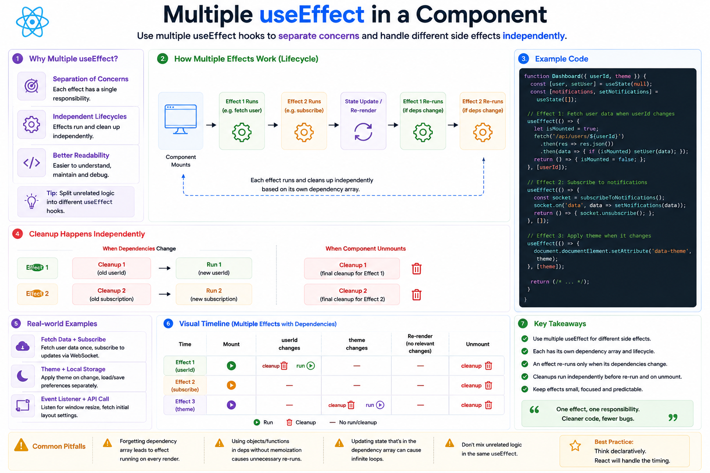

⚛️ **Should You Use Multiple `useEffect` Hooks?**

Yes. In fact, it's the **recommended approach**.

A common misconception is that a component should have only one `useEffect`.

In reality, React encourages you to use **multiple effects**, each with a single responsibility.

---

### ❌ One large effect

```jsx id="bad01"
useEffect(() => {
  fetchUser();

  document.title = "Dashboard";

  window.addEventListener("resize", handleResize);

  return () => {
    window.removeEventListener(
      "resize",
      handleResize
    );
  };
}, [userId, theme]);
```

This mixes unrelated logic together, making it harder to understand and maintain.

---

### ✅ Split effects by responsibility

```jsx id="good01"
useEffect(() => {
  fetchUser();
}, [userId]);

useEffect(() => {
  document.title = theme;
}, [theme]);

useEffect(() => {
  window.addEventListener("resize", handleResize);

  return () => {
    window.removeEventListener(
      "resize",
      handleResize
    );
  };
}, []);
```

Each effect now has a clear purpose.

---

### How React handles multiple effects

```text id="flow01"
Component Renders
        ↓
Effect #1 Runs
        ↓
Effect #2 Runs
        ↓
Effect #3 Runs
```

Each `useEffect`:

* Has its own dependency array
* Runs independently
* Cleans up independently

---

### Why this is better

✅ Easier to read

✅ Easier to debug

✅ Easier to test

✅ Fewer accidental dependency issues

✅ Better separation of concerns

---

### Real-world example

```jsx id="example01"
// Fetch user data
useEffect(() => {
  fetchUser(userId);
}, [userId]);

// Save theme preference
useEffect(() => {
  localStorage.setItem("theme", theme);
}, [theme]);

// Listen for window resize
useEffect(() => {
  window.addEventListener("resize", onResize);

  return () =>
    window.removeEventListener(
      "resize",
      onResize
    );
}, []);
```

Each effect is responsible for **one task**.

If one changes, the others remain untouched.

---

### 💡 Rule of Thumb

Think of `useEffect` like functions.

Instead of one giant function that does everything, write **small, focused effects**.

> **One effect = One responsibility.**

Your future self (and your teammates) will thank you.

Do you prefer one big `useEffect` or multiple small, focused effects?

