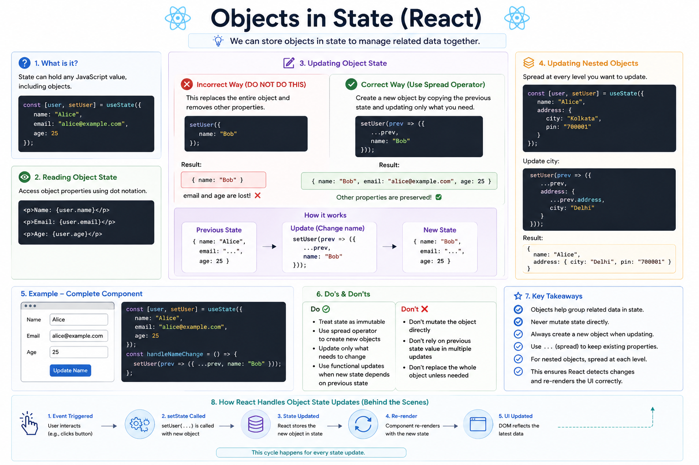

⚛️ **Objects in React State Explained**

React state isn't limited to numbers or strings.

You can store **objects** too, making it easy to keep related data together.

### Example

```jsx id="obj01"
const [user, setUser] = useState({
  name: "Alice",
  email: "alice@example.com",
  age: 25,
});
```

Now you can access the values like this:

```jsx id="obj02"
<p>{user.name}</p>
<p>{user.email}</p>
<p>{user.age}</p>
```

---

### ❌ Common Mistake

Updating an object like this:

```jsx id="bad01"
setUser({
  name: "Bob",
});
```

Result:

```text id="bad02"
{
  name: "Bob"
}
```

🚨 `email` and `age` are lost because React **replaces** the entire state object—it doesn't merge objects automatically.

---

### ✅ Correct Way

Use the spread operator to preserve the existing properties.

```jsx id="good01"
setUser(prev => ({
  ...prev,
  name: "Bob",
}));
```

Now the state becomes:

```text id="good02"
{
  name: "Bob",
  email: "alice@example.com",
  age: 25
}
```

Only the `name` changed. Everything else stays the same.

---

### Updating Nested Objects

If your state contains nested objects, spread each level you update.

```jsx id="nested01"
const [user, setUser] = useState({
  name: "Alice",
  address: {
    city: "Kolkata",
    pin: "700001",
  },
});
```

Update the city like this:

```jsx id="nested02"
setUser(prev => ({
  ...prev,
  address: {
    ...prev.address,
    city: "Delhi",
  },
}));
```

This keeps the other address fields intact.

---

### 💡 Best Practices

✅ Treat state as immutable
✅ Never modify objects directly
✅ Use the spread operator to create new objects
✅ Use functional updates when the next state depends on the previous state

React compares object references to detect changes.

Creating a **new object** ensures React knows the state changed and re-renders your component correctly.

Have you ever accidentally overwritten an object in state by forgetting the spread operator?

