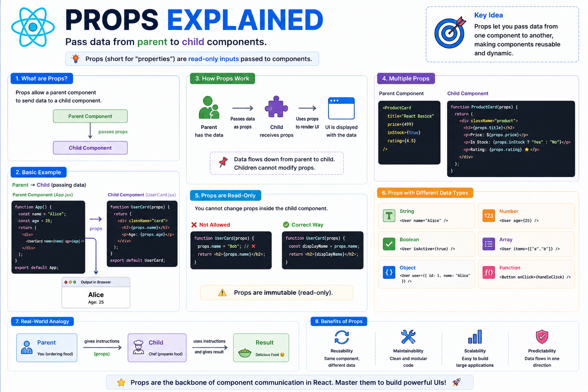

🎁 **Props Explained in React**

One of the first concepts every React developer should master is **Props**.

Think of props as **arguments for components**.

They let a parent component pass data to a child component.

Example:

```jsx id="props01"
function UserCard({ name, age }) {
  return (
    <>
      <h2>{name}</h2>
      <p>{age} years old</p>
    </>
  );
}
```

Now pass data like this:

```jsx id="props02"
<UserCard name="Alice" age={25} />
```

Output:

```
Alice
25 years old
```

A few important things to remember:

✅ Props are **read-only (immutable)**
✅ Data flows from **Parent → Child**
✅ The same component can display different data

For example:

```jsx id="props03"
<UserCard name="Alice" age={25} />
<UserCard name="Bob" age={30} />
<UserCard name="Charlie" age={22} />
```

Same component.

Different data.

That's the power of reusability.

Props can pass almost anything:

• Strings
• Numbers
• Booleans
• Arrays
• Objects
• Functions (event handlers)
• Even other React components

**Key takeaway:**

Props don't change the component's behavior by themselves—they provide the data a component needs to render different UI while keeping components reusable and predictable.

The diagram below explains how data flows from parent to child through props. 👇

#React #ReactJS #JavaScript #Frontend #WebDevelopment #Programming #Coding #ReactTips


