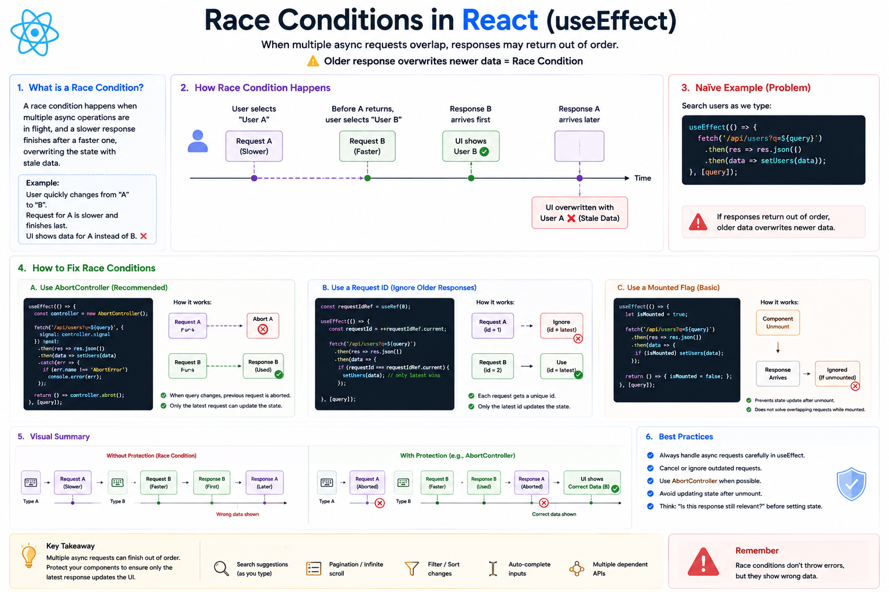

⚛️ **Race Conditions in React (`useEffect`) Explained**

Your code works perfectly...

Until users interact **faster than your API responds.** 😅

That's when **race conditions** can happen.

---

### What is a race condition?

A race condition occurs when **multiple asynchronous requests are in progress**, but their responses arrive **out of order**.

The older response can overwrite newer data.

---

### Example

Imagine you're building a search feature.

The user types:

```text id="flow01"
"a"
 ↓
"ap"
 ↓
"app"
```

React sends three API requests:

```text id="flow02"
Request A ("a")   🚀
Request B ("ap")  🚀
Request C ("app") 🚀
```

But the responses arrive like this:

```text id="flow03"
Request C ✅
Request B
Request A ❌
```

If you update state every time a response arrives...

Your UI may end up showing results for `"a"` instead of `"app"`.

---

### ❌ Naive implementation

```jsx id="bad01"
useEffect(() => {
  fetch(`/api/search?q=${query}`)
    .then(res => res.json())
    .then(setResults);
}, [query]);
```

Looks correct...

But older requests can still overwrite newer ones.

---

### ✅ Better approach: Abort previous requests

```jsx id="good01"
useEffect(() => {
  const controller = new AbortController();

  async function search() {
    const res = await fetch(
      `/api/search?q=${query}`,
      { signal: controller.signal }
    );

    const data = await res.json();
    setResults(data);
  }

  search();

  return () => controller.abort();
}, [query]);
```

Whenever `query` changes:

* Previous request is cancelled
* New request starts
* Only the latest response updates the UI

---

### Where race conditions commonly happen

🔍 Search suggestions

📄 Pagination

🔄 Infinite scrolling

🎯 Filters & sorting

👤 Switching between user profiles

Any feature that sends multiple requests in quick succession.

---

### 💡 Best Practices

✅ Cancel outdated requests with `AbortController` when possible.
✅ Clean up asynchronous work inside `useEffect`.
✅ Be careful when state updates depend on API responses arriving in order.
✅ Always think: **"What if an older request finishes last?"**

Race conditions don't usually crash your app...

They silently display **stale or incorrect data**, making them one of the trickiest bugs to debug.

Have you ever run into a race condition while building a search or filter feature?


