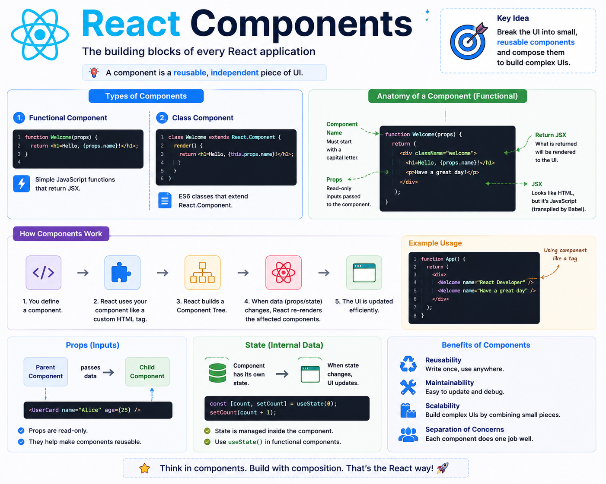

⚛️ **React Components Explained**

The biggest mindset shift in React is this:

👉 Stop thinking in pages.
👉 Start thinking in **components**.

A component is simply a **reusable piece of UI**.

For example:

```jsx
function Button() {
  return <button>Click Me</button>;
}
```

Now you can use it anywhere:

```jsx
function App() {
  return (
    <>
      <Button />
      <Button />
      <Button />
    </>
  );
}
```

Instead of writing the same HTML multiple times, you create it once and reuse it everywhere.

React apps are built by combining small components together:

```
App
├── Navbar
├── Sidebar
├── MainContent
│   ├── ProductCard
│   ├── ProductCard
│   └── ProductCard
└── Footer
```

Each component has one responsibility.

✅ Easier to read
✅ Easier to maintain
✅ Easier to test
✅ Easier to reuse

As your application grows, this approach keeps your codebase organized and scalable.

**Key takeaway:**

React isn't about writing one huge file.

It's about breaking your UI into small, independent, reusable components that work together to build complex applications.

The diagram below shows how components, props, and state fit together. 👇

#React #ReactJS #JavaScript #Frontend #WebDevelopment #Programming #Coding


