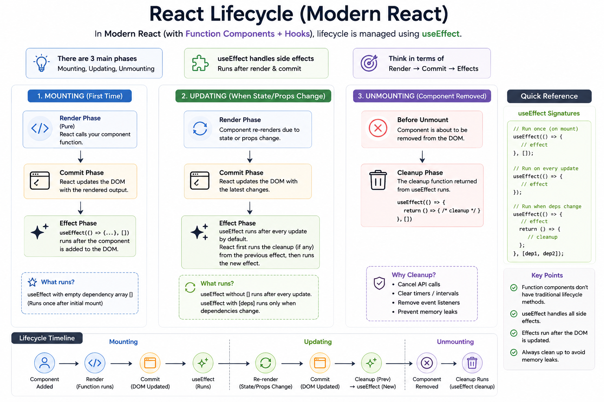

⚛️ **React Lifecycle in Modern React (Hooks Edition)**

If you're learning React, stop thinking in terms of class lifecycle methods like `componentDidMount()`.

In **Modern React**, everything revolves around **Render → Commit → Effects**.

Here's the lifecycle:

### 🟢 1. Mounting (First Render)

Component is created.

Flow:

```
Render
   ↓
Commit (DOM Updated)
   ↓
useEffect()
```

```jsx
useEffect(() => {
  console.log("Component mounted");
}, []);
```

Runs **once** after the initial render.

---

### 🔵 2. Updating

Whenever **state** or **props** change:

```
Render
   ↓
Commit
   ↓
Cleanup Previous Effect
   ↓
Run New Effect
```

```jsx
useEffect(() => {
  console.log("Count changed:", count);
}, [count]);
```

React first cleans up the previous effect (if needed), then runs the new one.

---

### 🔴 3. Unmounting

When the component is removed from the DOM:

```jsx
useEffect(() => {
  const id = setInterval(fetchData, 1000);

  return () => {
    clearInterval(id);
  };
}, []);
```

The cleanup function runs to:
✅ Clear timers
✅ Cancel API requests
✅ Remove event listeners
✅ Prevent memory leaks

### 💡 Think of the lifecycle like this:

```
Mount
  ↓
Render
  ↓
Commit
  ↓
Effects
  ↓
State Changes
  ↓
Render Again
  ↓
Cleanup
  ↓
New Effect
  ↓
Unmount
  ↓
Final Cleanup
```

The biggest mindset shift in Modern React:

👉 Don't think in lifecycle methods.

Think in **"What side effect should happen after this render?"**

That's exactly what `useEffect` is designed for.

What's the next Hooks topic you'd like to learn—`useLayoutEffect`, `useMemo`, or `useCallback`?


