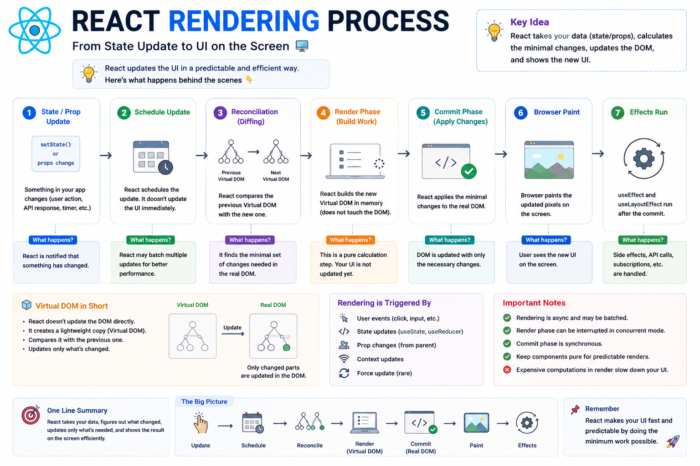

⚛️ **React Rendering Process Explained**

Ever wondered what actually happens after you call `setState()` or update a prop?

It isn't:

❌ Change state → Update DOM instantly

React follows a well-defined rendering process.

Here's what happens behind the scenes 👇

### 1️⃣ State or Props Change

A user action, API response, or parent component updates the data.

```jsx id="render01"
setCount(count + 1);
```

### 2️⃣ React Schedules the Update

React doesn't always update the UI immediately.

It may batch multiple updates together for better performance.

### 3️⃣ Reconciliation (Diffing)

React compares the **new Virtual DOM** with the previous one.

It calculates the **smallest set of changes** needed.

### 4️⃣ Render Phase

React builds the next UI **in memory**.

No changes are made to the browser DOM yet.

### 5️⃣ Commit Phase

React applies only the required changes to the **Real DOM**.

### 6️⃣ Browser Paints

The browser renders the updated pixels on the screen.

Now the user sees the new UI.

### 7️⃣ Effects Run

After the DOM is updated, React executes:

* `useEffect()`
* `useLayoutEffect()`

This is where API calls, subscriptions, analytics, and other side effects happen.

### Why is this process so efficient?

✅ Updates are batched when possible
✅ Only changed elements are updated
✅ Expensive DOM operations are minimized
✅ Your UI stays fast and predictable

**Key takeaway:**

React doesn't directly update the DOM after every state change.

It first calculates **what actually changed**, then performs the minimum amount of work needed to update the UI.

That's one of the biggest reasons React scales so well.

The diagram below shows the complete rendering lifecycle from state update → Virtual DOM → Commit → Browser Paint → Effects. 👇

#React #ReactJS #JavaScript #Frontend #WebDevelopment #Programming #Coding #ReactTips


