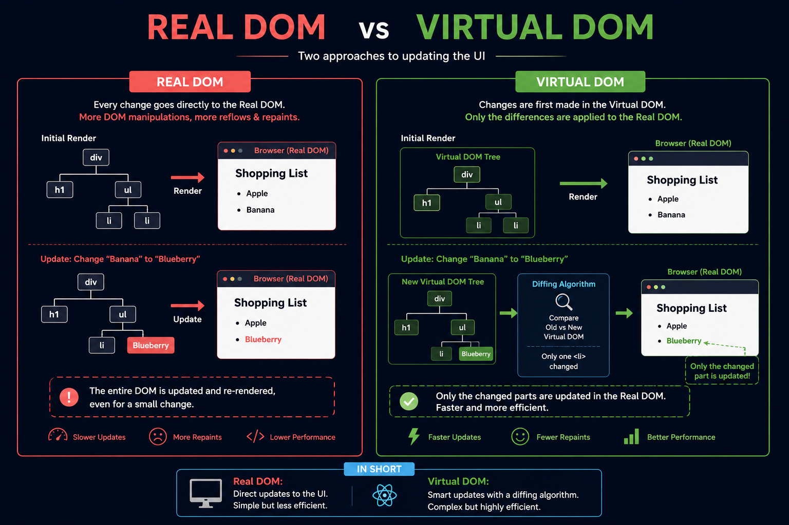

⚛️ **Real DOM vs Virtual DOM**

One of the biggest reasons React feels so fast isn't because it avoids the DOM...

It's because it updates it intelligently.

Here's the difference 👇

🔴 **Real DOM**
• Updates the actual browser DOM directly
• Every change can trigger reflow and repaint
• Even a small update may affect larger parts of the UI
• Slower as the application grows

🟢 **Virtual DOM**
• Keeps a lightweight copy of the Real DOM in memory
• Creates a new Virtual DOM after every state change
• Compares the new tree with the previous one (Diffing)
• Updates **only the changed elements** in the Real DOM

Example:

Before:

* Apple
* Banana

After:

* Apple
* Blueberry

❌ Real DOM approach: Re-render more of the UI than necessary.

✅ Virtual DOM approach: React detects that only one list item changed and updates just that element.

**Key takeaway:**
The Virtual DOM doesn't replace the Real DOM—it makes updating it much more efficient.

That's why React apps can stay fast even as they become more complex.

Which frontend framework did you learn first—React, Angular, Vue, or something else? 👇

#React #ReactJS #JavaScript #Frontend #WebDevelopment #Programming #Coding #100DaysOfCode

