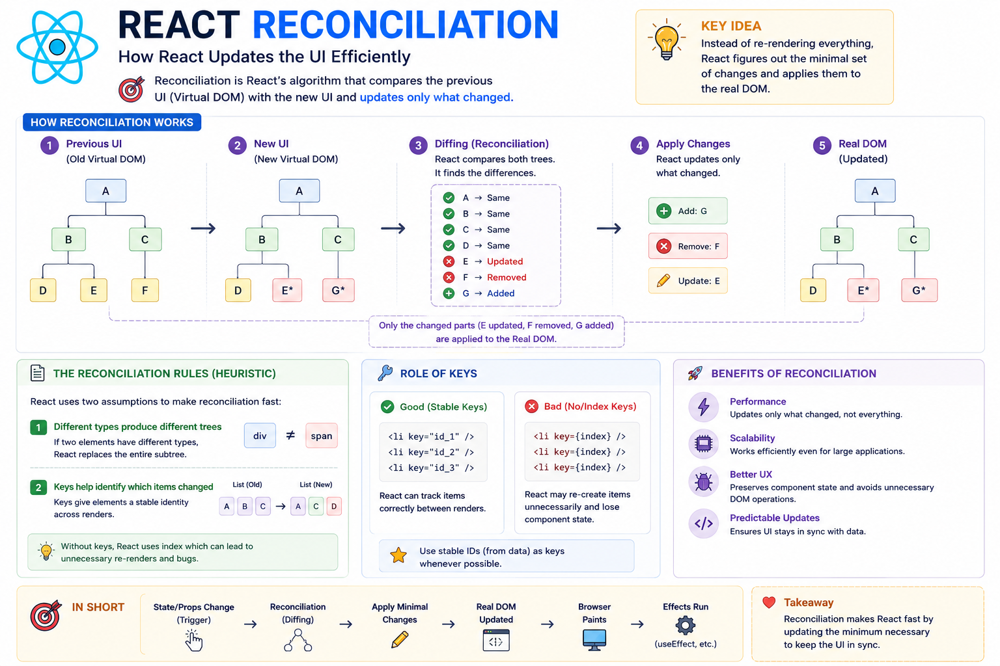

⚛️ **React Reconciliation Explained**

One of the biggest reasons React is fast is its **Reconciliation** algorithm.

But what does it actually do?

Imagine your UI changes like this:

Before 👇

```text
🍎 Apple
🍌 Banana
🥭 Mango
```

After 👇

```text
🍎 Apple
🫐 Blueberry
🥭 Mango
```

React doesn't rebuild the entire UI.

Instead, it goes through a process called **Reconciliation**.

Here's what happens:

### 1️⃣ Create a New Virtual DOM

After a state or prop update, React creates a new Virtual DOM tree.

### 2️⃣ Compare Old vs New (Diffing)

React compares the previous Virtual DOM with the new one.

It looks for:

✅ Added elements
✅ Removed elements
✅ Updated elements

### 3️⃣ Calculate the Minimum Changes

Instead of replacing everything, React figures out the **smallest set of updates** needed.

### 4️⃣ Update the Real DOM

Only those changed elements are updated in the browser.

Everything else stays untouched.

### Why is this efficient?

✅ Fewer DOM operations
✅ Better performance
✅ Preserves component state when possible
✅ Smooth UI updates

### Why do `key` props matter?

When rendering lists, React uses `key` values to match elements between renders.

Stable keys help React understand whether an item was:

• Updated
• Moved
• Added
• Removed

Without proper keys, React may recreate elements unnecessarily or lose component state.

**Key takeaway:**

Reconciliation is React's optimization engine.

It compares the old and new Virtual DOM trees, calculates the minimum required changes, and updates only what's necessary—keeping your apps fast, predictable, and efficient.

The diagram below walks through the complete reconciliation process step by step. 👇

#React #ReactJS #JavaScript #Frontend #WebDevelopment #Programming #Coding #ReactTips


