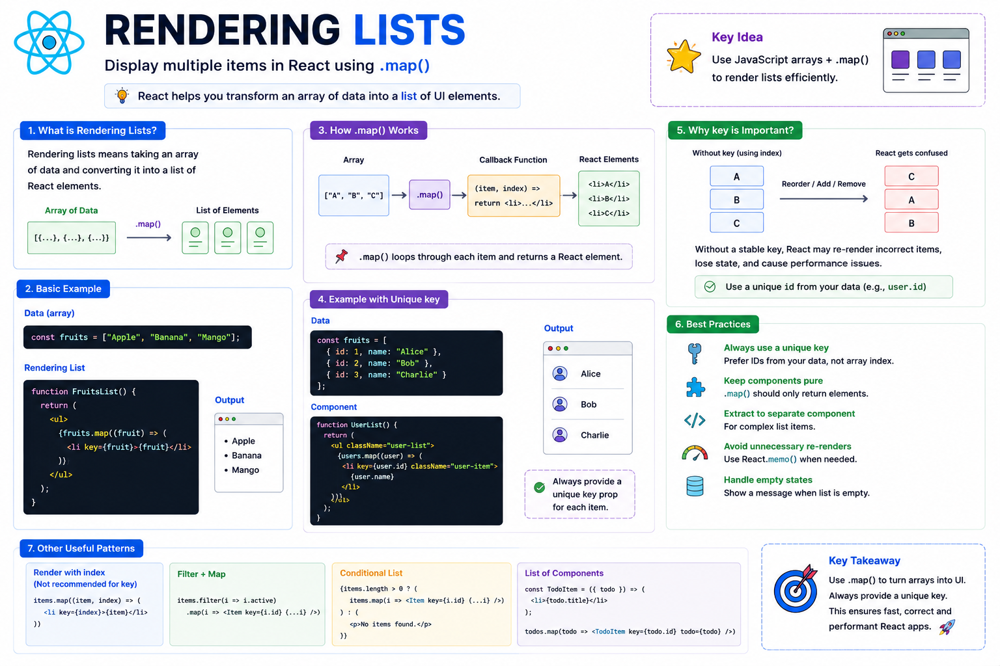

📋 **Rendering Lists in React Explained**

Displaying one item is easy.

But what if you have **100 products**, **50 users**, or **1,000 messages**?

That's where **list rendering** comes in.

React uses JavaScript's `.map()` method to turn arrays into UI.

Example:

```jsx
const fruits = ["Apple", "Banana", "Mango"];

function FruitList() {
  return (
    <ul>
      {fruits.map((fruit) => (
        <li key={fruit}>{fruit}</li>
      ))}
    </ul>
  );
}
```

Output:

• Apple
• Banana
• Mango

### Why do we need `key`?

Every item in a list should have a **unique key**.

```jsx
users.map((user) => (
  <UserCard key={user.id} user={user} />
));
```

Keys help React:

✅ Identify which items changed
✅ Add or remove items efficiently
✅ Reorder lists correctly
✅ Avoid unnecessary re-renders

⚠️ Avoid using the array index as the key if your list can change.

```jsx
// ❌ Not recommended
items.map((item, index) => (
  <Item key={index} />
));
```

Instead, use a stable unique ID whenever possible.

**Real-world examples:**

• Product grids
• Chat messages
• Todo lists
• Notifications
• Comments
• Search results

**Key takeaway:**

Think of `.map()` as a way to transform **data → UI**.

And think of `key` as React's way of tracking each item so it can update your UI efficiently.

The diagram below explains the complete list rendering flow, from arrays to rendered components. 👇

#React #ReactJS #JavaScript #Frontend #WebDevelopment #Programming #Coding #ReactTips


