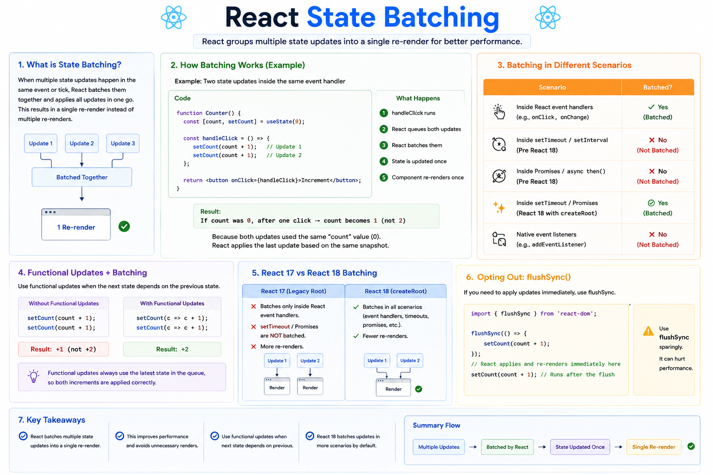

⚛️ **React State Batching Explained**

Have you ever wondered why calling `setState` multiple times doesn't always cause multiple re-renders?

That's because React uses **State Batching**.

It groups multiple state updates together and performs **one re-render** instead of many, making your app more efficient.

### Example

```jsx id="batch01"
function Counter() {
  const [count, setCount] = useState(0);

  const handleClick = () => {
    setCount(count + 1);
    setCount(count + 1);
  };

  return <button onClick={handleClick}>+</button>;
}
```

After one click, what do you expect?

👉 `count = 2` ❌

Actual result:

👉 `count = 1` ✅

Why?

Both updates use the same snapshot of `count` (`0`), and React batches them into a single render.

---

### The correct approach

When the next state depends on the previous one, use a functional update:

```jsx id="batch02"
setCount(prev => prev + 1);
setCount(prev => prev + 1);
```

Now React processes the updates in sequence:

```text id="flow01"
0
↓
1
↓
2
```

Final result:

```text id="flow02"
count = 2 ✅
```

---

### What does batching do?

```text id="flow03"
setState()
setState()
setState()
      ↓
React queues updates
      ↓
Processes them together
      ↓
One component re-render
      ↓
Updated UI
```

Instead of rendering after every update, React combines them to improve performance.

---

### React 18 made batching even better

With **automatic batching**, React batches state updates in more situations than before, including many asynchronous scenarios such as promise callbacks and timeouts.

This means:

✅ Fewer re-renders
✅ Better performance
✅ Smoother user experience

---

### 💡 Key Takeaways

✅ React batches multiple state updates into a single re-render whenever possible.
✅ State updates don't happen immediately—they're queued and processed together.
✅ If the next state depends on the previous one, always use functional updates (`prev => ...`).
✅ Batching improves performance by reducing unnecessary renders.

Understanding state batching helps explain why React sometimes behaves differently than you'd expect—and why functional updates are so important.

Did state batching surprise you when you first started learning React?


