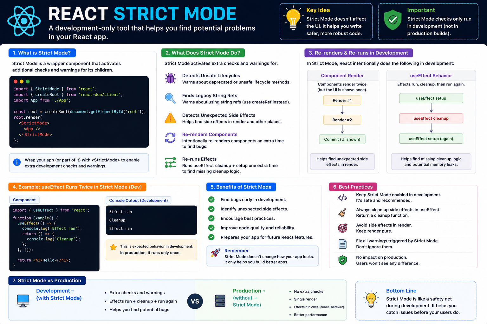

🛡️ **React Strict Mode Explained**

Have you ever noticed this?

```jsx
useEffect(() => {
  console.log("Effect ran");
}, []);
```

In development, the console logs **twice**.

Many developers think it's a bug.

It isn't.

It's **React Strict Mode** doing its job.

### What is Strict Mode?

`<StrictMode>` is a development-only tool that helps you find potential problems in your React application.

```jsx
import { StrictMode } from "react";
import { createRoot } from "react-dom/client";

createRoot(document.getElementById("root")).render(
  <StrictMode>
    <App />
  </StrictMode>
);
```

### What does it do?

During development, React may intentionally:

✅ Render components an extra time
✅ Re-run Effects (setup → cleanup → setup)
✅ Detect unexpected side effects
✅ Warn about deprecated APIs and unsafe patterns

This helps uncover bugs that might otherwise be difficult to find.

### Important

🚫 Strict Mode **does not run these extra checks in production**.

Your users won't see double renders or duplicated effects in a production build.

### Best practices

• Keep components pure
• Always return cleanup functions from `useEffect`
• Avoid side effects during rendering
• Fix warnings instead of ignoring them

**Key takeaway:**

Strict Mode isn't slowing your app down—it's acting like a safety net during development.

If something breaks under Strict Mode, there's a good chance it's exposing a real issue that should be fixed before shipping.

The diagram below explains why components and Effects appear to run twice in development and why that's expected behavior. 👇

#React #ReactJS #JavaScript #Frontend #WebDevelopment #Programming #Coding #ReactTips


