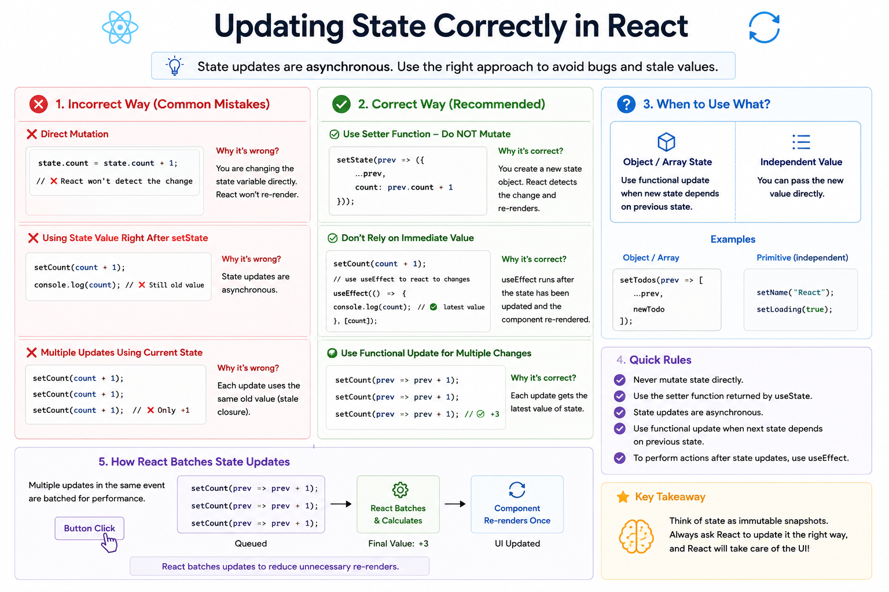

⚛️ **Updating State Correctly in React**

One of the most common mistakes beginners make is updating state the wrong way.

Understanding **how React processes state updates** will help you avoid subtle bugs.

### ❌ Don't mutate state directly

```jsx id="mut01"
count = count + 1;
```

or

```jsx id="mut02"
user.name = "Alex";
```

React won't know the state changed, so your UI may not update correctly.

---

### ✅ Always use the state setter

```jsx id="good01"
setCount(count + 1);
```

For objects:

```jsx id="good02"
setUser({
  ...user,
  name: "Alex",
});
```

This creates a **new state object**, allowing React to detect the change and re-render the component.

---

### ❗ When the next state depends on the previous state

Avoid this:

```jsx id="bad03"
setCount(count + 1);
setCount(count + 1);
setCount(count + 1);
```

You might expect the result to be **+3**, but it'll often only increment by **1** because each update uses the same stale value.

Instead, use a functional update:

```jsx id="good03"
setCount(prev => prev + 1);
setCount(prev => prev + 1);
setCount(prev => prev + 1);
```

Now the count correctly increases by **3**.

---

### 🧠 Remember this rule

Use:

```jsx id="rule01"
setState(newValue);
```

when you already know the next value.

Use:

```jsx id="rule02"
setState(prev => /* calculate next state */);
```

when the new value depends on the previous one.

---

### 💡 Key Takeaways

✅ Never mutate state directly
✅ Use the setter returned by `useState`
✅ Create new objects/arrays instead of modifying existing ones
✅ Use functional updates when calculating the next state from the previous state

React state should be treated as **immutable snapshots**, not variables you modify directly.

Master this concept, and you'll avoid many of the bugs that trip up React developers.

What's the biggest React state bug you've encountered while learning?


