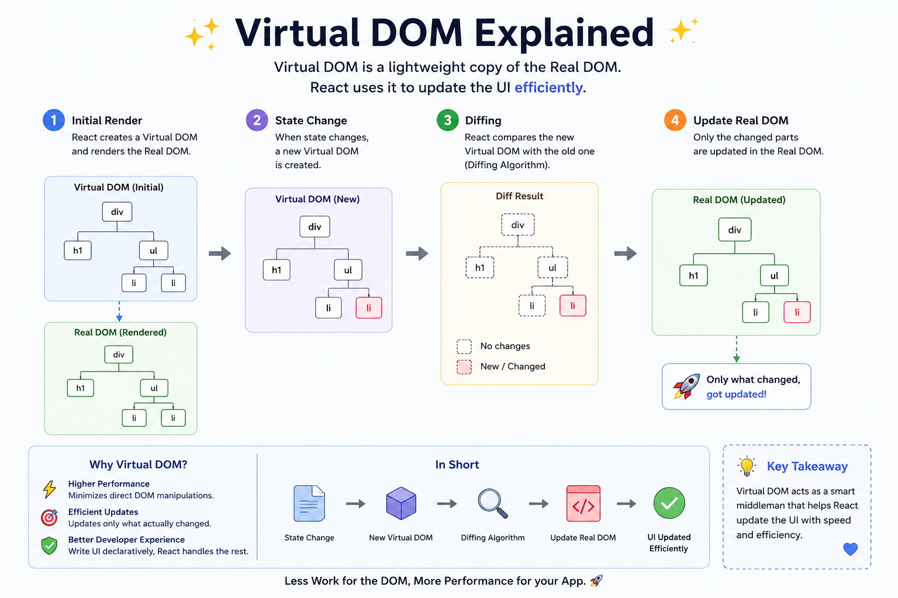

🚀 **Virtual DOM Explained in 60 Seconds**

Many developers think React is fast because of the Virtual DOM.

That's only half the story.

Here's what actually happens:

1️⃣ Your component state changes.
2️⃣ React creates a **new Virtual DOM** (a lightweight JavaScript representation of the UI).
3️⃣ React compares it with the previous Virtual DOM (called **Diffing**).
4️⃣ It finds exactly what changed.
5️⃣ Only those specific changes are applied to the **Real DOM**.

Instead of rebuilding the entire page, React performs the smallest possible update.

✅ Fewer DOM operations
✅ Better rendering performance
✅ Smoother user experience

Think of it like editing a document:

❌ Rewrite the entire document every time.
✅ Change only the modified sentence.

That's exactly how React keeps your UI efficient.

Check out the diagram below 👇

#React #JavaScript #WebDevelopment #Frontend #ReactJS #100DaysOfCode #Programming #Coding

