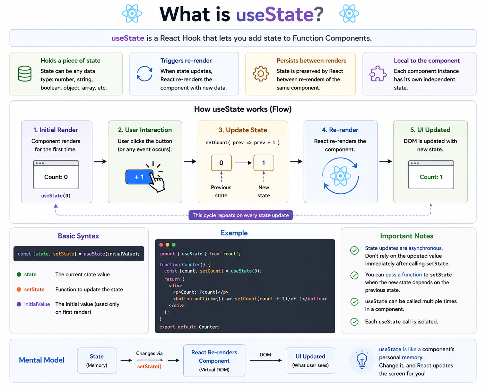

⚛️ **What is `useState` in React?**

If React components had memory, **`useState` would be that memory.**

It lets Function Components store and update data over time.

### Basic Syntax

```jsx
const [state, setState] = useState(initialValue);
```

* `state` → Current value
* `setState` → Function to update the value
* `initialValue` → Used only on the first render

### Example

```jsx
import { useState } from "react";

function Counter() {
  const [count, setCount] = useState(0);

  return (
    <>
      <h2>{count}</h2>

      <button onClick={() => setCount(count + 1)}>
        Increment
      </button>
    </>
  );
}
```

### What happens when you click the button?

```
Initial Render
      ↓
count = 0
      ↓
User clicks button
      ↓
setCount(1)
      ↓
React updates state
      ↓
Component re-renders
      ↓
UI shows Count: 1
```

### Why use `useState`?

✅ Stores component data
✅ Automatically triggers a re-render when state changes
✅ Keeps state between renders
✅ Makes your UI interactive

### Common Mistake ❌

```jsx
count = count + 1; // Won't update the UI
```

Always update state like this:

```jsx
setCount(count + 1);
```

Or, when the next value depends on the previous one:

```jsx
setCount(prev => prev + 1);
```

This avoids stale state and is the recommended pattern for updates based on the previous value.

💡 **Remember:**

`useState` doesn't directly change the UI.

It updates the component's **state**, and React takes care of re-rendering the UI with the latest value.

What's the first thing you built using `useState`—a counter, a toggle, or a form?


