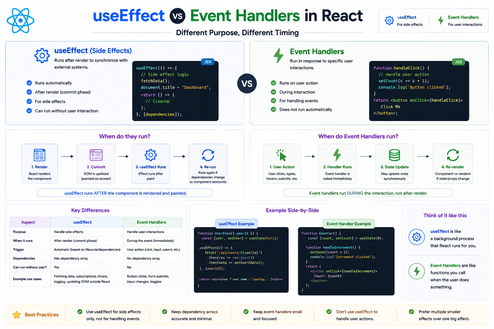

⚛️ **`useEffect` vs Event Handlers in React**

A common question for React beginners:

> **Should this logic go inside `useEffect` or an event handler?**

The answer depends on **why** the code should run.

---

## 🟢 Use Event Handlers for User Actions

If the code should run **because the user did something**, use an event handler.

```jsx id="event01"
function handleSubmit() {
  saveOrder();
}

<button onClick={handleSubmit}>
  Submit
</button>
```

Examples:

✅ Button clicks

✅ Form submissions

✅ Input changes

✅ Keyboard events

Event handlers run **immediately in response to user interactions**.

---

## 🔵 Use `useEffect` for Side Effects

If the code should run **because the component rendered or some state changed**, use `useEffect`.

```jsx id="effect01"
useEffect(() => {
  document.title = `Count: ${count}`;
}, [count]);
```

Examples:

✅ Fetching API data

✅ Syncing with `localStorage`

✅ Adding event listeners

✅ Starting timers

✅ Updating the document title

Effects run **after React updates the UI**.

---

## Think about the trigger

```text id="flow01"
User Clicks Button
        ↓
Event Handler Runs
```

vs.

```text id="flow02"
State Changes
        ↓
Component Re-renders
        ↓
useEffect Runs
```

The key difference is **what triggers the code**.

---

## ❌ Common Mistake

Using `useEffect` to respond to a button click:

```jsx id="bad01"
useEffect(() => {
  if (submitted) {
    saveOrder();
  }
}, [submitted]);
```

This adds unnecessary state and complexity.

Instead, call the function directly from the click handler:

```jsx id="good01"
function handleSubmit() {
  saveOrder();
}

<button onClick={handleSubmit}>
  Submit
</button>
```

It's simpler and easier to follow.

---

## 💡 Rule of Thumb

Use **Event Handlers** when:

✅ The user clicks, types, submits, or interacts.

Use **`useEffect`** when:

✅ Your component needs to synchronize with something outside React after rendering.

---

### Quick comparison

| Event Handlers                          | `useEffect`                              |
| --------------------------------------- | ---------------------------------------- |
| Triggered by user actions               | Triggered after rendering                |
| Runs immediately during the interaction | Runs after React commits updates         |
| Handles UI interactions                 | Handles side effects and synchronization |

Understanding this distinction makes your React code cleaner, easier to maintain, and less prone to unnecessary effects.

When building a feature, do you first ask yourself **"What should happen?"** or **"What triggered this?"**? That question often leads you to the right choice.


