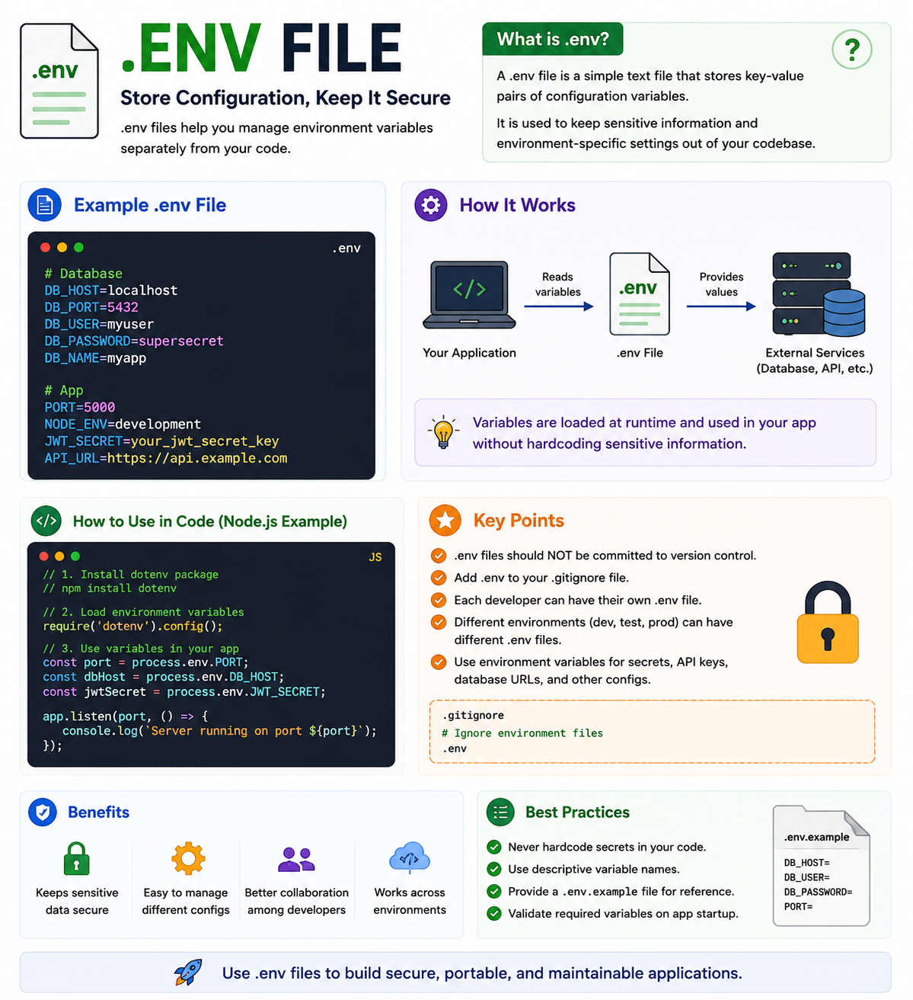

Have you ever seen code like this?

```js
const dbPassword = "my-super-secret-password";
const apiKey = "sk_live_xxxxxxxxx";
```

If yes... that's a security risk. 🚨

Hardcoding secrets makes them easy to expose and difficult to manage.

That's why developers use **`.env` files**.

---

## What is a `.env` File?

A `.env` file stores **environment variables**—configuration values that your application needs at runtime.

Instead of hardcoding sensitive information, you keep it outside your source code.

Example:

```env
PORT=5000
DB_HOST=localhost
DB_USER=admin
DB_PASSWORD=super_secret
JWT_SECRET=my_jwt_secret
API_KEY=xxxxxxxxxx
```

Your application can then access these values:

```js
const port = process.env.PORT;
const dbHost = process.env.DB_HOST;
```

---

## Why Use `.env` Files?

✅ Keeps secrets out of your codebase

✅ Makes switching between environments easy

✅ Prevents accidental exposure of API keys and passwords

✅ Allows different configurations for development, testing, and production

---

## Common Environment Variables

```env
PORT=5000
NODE_ENV=production
DATABASE_URL=...
JWT_SECRET=...
REDIS_URL=...
API_KEY=...
```

Almost every backend application has a `.env` file.

---

## Best Practices

✅ Add `.env` to your `.gitignore`.

✅ Never commit secrets to GitHub.

✅ Use descriptive variable names.

✅ Create a `.env.example` file with placeholder values for teammates.

✅ Validate required environment variables when your application starts.

---

## Common Mistakes

❌ Hardcoding passwords or API keys.

❌ Sharing the `.env` file publicly.

❌ Using the same secrets across all environments.

❌ Forgetting to rotate compromised secrets.

---

## `.env` vs `.env.example`

📄 **`.env`**

* Contains your real configuration values.
* Private.
* Never committed to version control.

📄 **`.env.example`**

* Contains only variable names or dummy values.
* Safe to commit.
* Helps other developers know which variables are required.

---

Think of a `.env` file as your application's **configuration vault**.

Your code stays the same, while the configuration changes depending on where the application is running.

That's one of the key principles behind building secure and portable applications.

Do you also use `.env.example` in your projects?

👇 I'd love to hear your workflow.

#NodeJS #JavaScript #Backend #DotEnv #EnvironmentVariables #WebDevelopment #SoftwareEngineering #ExpressJS #Programming #DevOps


