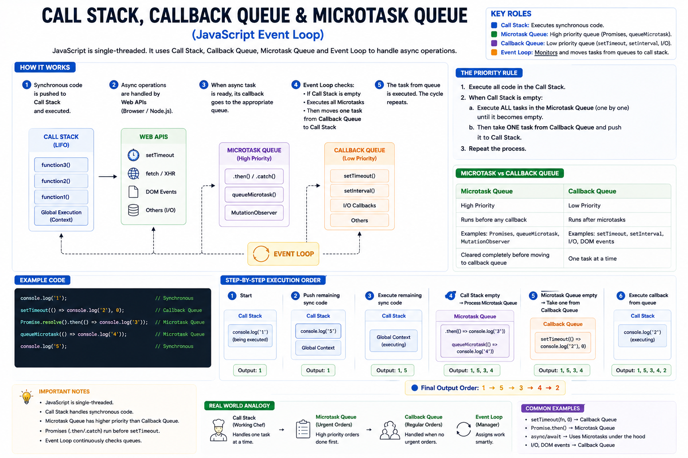

One of the most common JavaScript interview questions is:

> **Why does `Promise.then()` execute before `setTimeout()` even when the timeout is `0ms`?**

The answer lies in understanding three core concepts:

🟦 **Call Stack**

🟩 **Microtask Queue**

🟨 **Callback Queue**

And the component that connects them all:

🔄 **The Event Loop**

Let's break it down.

---

## JavaScript is Single-Threaded

JavaScript can execute **only one piece of code at a time**.

It doesn't create multiple threads to run your code simultaneously.

Instead, it uses:

* Call Stack
* Web APIs / Node.js APIs
* Microtask Queue
* Callback Queue
* Event Loop

Together, they make asynchronous programming possible.

---

## 1️⃣ Call Stack

The **Call Stack** is where JavaScript executes synchronous code.

It follows the **LIFO (Last In, First Out)** principle.

Example:

```javascript
function one() {
  two();
}

function two() {
  console.log("Hello");
}

one();
```

Execution order:

```text
Global()
   │
one()
   │
two()
   │
console.log()
```

Each function is pushed onto the stack and removed once it finishes.

Only one function executes at a time.

---

## 2️⃣ Web APIs / Node.js APIs

When JavaScript encounters asynchronous operations like:

* `setTimeout()`
* `fetch()`
* File System
* HTTP Requests
* Database Queries

they **do not stay in the Call Stack**.

Instead, they're handed over to the browser's Web APIs or Node.js runtime.

Example:

```javascript
setTimeout(() => {
  console.log("Done");
}, 1000);
```

The timer runs outside the Call Stack.

Meanwhile, JavaScript continues executing the remaining synchronous code.

---

## 3️⃣ Callback Queue (Task Queue)

Once asynchronous tasks like:

* `setTimeout`
* `setInterval`
* DOM Events
* I/O callbacks

are complete, their callbacks are placed into the **Callback Queue**.

Example:

```javascript
setTimeout(() => {
  console.log("Timer");
}, 0);
```

Even with `0ms`, the callback **does not execute immediately**.

It waits until the Call Stack becomes empty.

---

## 4️⃣ Microtask Queue

The **Microtask Queue** has **higher priority** than the Callback Queue.

It stores callbacks from:

* `Promise.then()`
* `Promise.catch()`
* `Promise.finally()`
* `queueMicrotask()`

Example:

```javascript
Promise.resolve().then(() => {
  console.log("Promise");
});
```

This callback goes into the **Microtask Queue**.

---

## 5️⃣ Event Loop

The Event Loop continuously checks:

"Is the Call Stack empty?"

If the answer is **Yes**:

1. Execute **all Microtasks**.

2. Then execute **one Callback Queue task**.

3. Repeat.

This priority is the reason Promise callbacks run before timer callbacks.

---

## Execution Priority

```text
Synchronous Code
        ↓
Microtask Queue
        ↓
Callback Queue
```

Always remember:

🟢 **Microtasks have higher priority than Callback Queue tasks.**

---

## Example

```javascript
console.log("1");

setTimeout(() => {
  console.log("2");
}, 0);

Promise.resolve().then(() => {
  console.log("3");
});

queueMicrotask(() => {
  console.log("4");
});

console.log("5");
```

---

### Step-by-Step Execution

**Step 1**

Synchronous code:

```text
console.log("1")
console.log("5")
```

Output:

```text
1
5
```

---

**Step 2**

Call Stack becomes empty.

Event Loop checks Microtask Queue.

It contains:

```text
Promise.then()
queueMicrotask()
```

Output becomes:

```text
1
5
3
4
```

---

**Step 3**

Microtask Queue is now empty.

Event Loop checks Callback Queue.

It contains:

```text
setTimeout()
```

Final Output:

```text
1
5
3
4
2
```

---

## Why Promises Execute First

Many developers think:

```javascript
setTimeout(fn, 0)
```

means "execute immediately."

It doesn't.

It means:

> Execute **after at least 0ms**, **and only when the Call Stack is empty and all Microtasks have finished.**

That's why:

```javascript
Promise.resolve().then(...)
```

always runs before:

```javascript
setTimeout(..., 0)
```

---

## Common Mistakes

❌ Assuming `setTimeout(..., 0)` runs instantly.

❌ Forgetting that JavaScript executes synchronous code first.

❌ Ignoring the priority of the Microtask Queue.

❌ Thinking Promises create new threads.

---

## Easy Way to Remember

📚 **Call Stack** → Executes synchronous code.

⚡ **Microtask Queue** → High-priority async tasks (Promises, `queueMicrotask`).

📥 **Callback Queue** → Lower-priority async tasks (`setTimeout`, I/O, DOM events).

🔄 **Event Loop** → Moves tasks to the Call Stack when it's ready.

---

Understanding these four concepts explains almost every question about JavaScript's asynchronous behavior.

Once you master the Event Loop, debugging async code becomes much easier.

What's your favorite JavaScript interview question related to the Event Loop?

👇 Share it below!

#JavaScript #EventLoop #CallStack #Promises #AsyncAwait #WebDevelopment #Frontend #NodeJS #Programming #SoftwareEngineering


