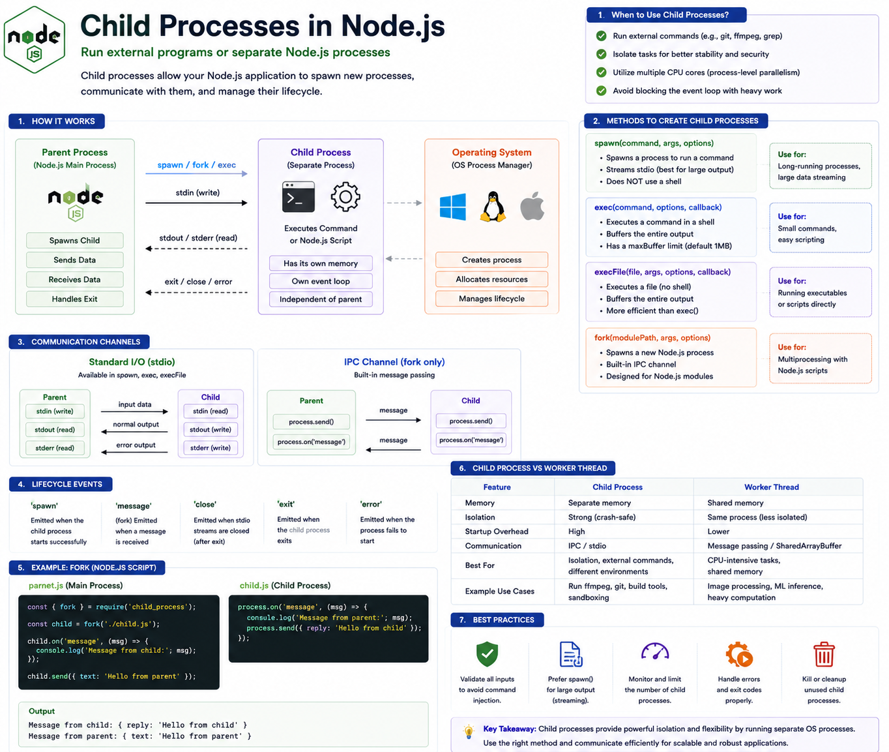

Node.js is great at handling asynchronous I/O.

But what if you need to:

✅ Run an external command

✅ Execute another Node.js application

✅ Isolate a long-running task

✅ Process work in a completely separate environment

That's where **Child Processes** come in.

Instead of doing everything inside one process, Node.js can create **new operating system processes** that run independently.

Let's see how they work. 👇

---

## What are Child Processes?

A **Child Process** is a completely separate operating system process created by your Node.js application.

Each child process has its own:

🟢 Memory

🟢 V8 Engine

🟢 Event Loop

🟢 Process ID (PID)

🟢 Resources

If the child process crashes, the parent process can often continue running.

This isolation makes child processes useful for many production workloads.

---

## Why Do We Need Child Processes?

Some tasks shouldn't run inside your main application.

Examples:

* Running **FFmpeg** for video conversion
* Executing **Git** commands
* Compressing large files
* Running Python scripts
* Calling shell commands
* Executing another Node.js application

Instead of blocking your server, these tasks can run in separate processes.

---

## How Child Processes Work

The flow looks like this:

```text id="r8m4pv"
Main Node.js Process
          │
   Create Child Process
          │
          ▼
 Separate OS Process
          │
 Execute Task
          │
 Send Result
          │
          ▼
 Parent Process
```

The parent and child communicate while remaining independent.

---

## Ways to Create Child Processes

Node.js provides four main methods from the `child_process` module.

### 1️⃣ `spawn()`

Starts a new process and streams its input/output.

Best for:

✅ Long-running processes

✅ Large output

✅ Streaming data

Example:

```js id="j4n7xt"
spawn("ls", ["-la"]);
```

---

### 2️⃣ `exec()`

Runs a command inside a shell and buffers the entire output.

Best for:

✅ Small commands

✅ Quick shell scripts

Example:

```js id="t6z3qb"
exec("git status");
```

Because the output is buffered, it isn't ideal for commands that produce very large amounts of data.

---

### 3️⃣ `execFile()`

Runs an executable file directly without starting a shell.

Benefits:

✅ Lower overhead than `exec()`

✅ Avoids shell interpretation

Useful when you already know the executable you want to run.

---

### 4️⃣ `fork()`

Creates another **Node.js process**.

Unlike the other methods, `fork()` establishes a built-in IPC (Inter-Process Communication) channel, making it easy for two Node.js processes to exchange messages.

Example:

```js id="v2p8rm"
const child = fork("./worker.js");
```

---

## Parent and Child Communication

The parent can send messages:

```js id="m5x9kd"
child.send({
  task: "compress",
});
```

The child receives them:

```js id="g3w6fy"
process.on("message", (msg) => {
  console.log(msg);
});
```

And responds:

```js id="k7r2la"
process.send({
  success: true,
});
```

This message-based communication keeps the processes isolated while still allowing them to coordinate work.

---

## Child Process vs Worker Thread

Developers often confuse these.

### 🧵 Worker Thread

* Runs inside the same Node.js process
* Lower memory overhead
* Faster communication
* Best for CPU-intensive JavaScript code

---

### ⚙️ Child Process

* Separate operating system process
* Separate memory space
* Strong isolation
* Can run external programs or another Node.js application

---

## When Should You Use Child Processes?

Perfect for:

✅ Running shell commands

✅ FFmpeg

✅ ImageMagick

✅ Git automation

✅ Backup scripts

✅ Python programs

✅ CLI tools

✅ Isolated services

---

## When Should You NOT Use Them?

Avoid Child Processes when:

❌ You only need asynchronous file or network I/O (Node.js already handles this efficiently).

❌ The task is lightweight.

❌ You only need parallel JavaScript execution—**Worker Threads** are often a better fit for CPU-bound JavaScript code.

Creating a new process has startup and memory overhead.

---

## Benefits

🚀 Better isolation

🛡️ Fault tolerance

⚡ Can use multiple CPU cores

🔄 Run external applications

🧩 Suitable for heterogeneous workloads

---

## Common Mistakes

❌ Using `exec()` for commands with huge output.

❌ Forgetting to handle process exit or errors.

❌ Spawning too many child processes.

❌ Passing unsanitized user input to shell commands, which can lead to command injection.

❌ Leaving unused child processes running.

---

## Best Practices

✅ Choose the right API (`spawn`, `exec`, `execFile`, or `fork`) based on your use case.

✅ Validate and sanitize inputs before invoking external commands.

✅ Monitor and clean up child processes.

✅ Handle exit codes and error events.

✅ Limit the number of concurrent child processes.

---

## A Simple Way to Remember

🧠 **Main Process** → Runs your Node.js application.

🧵 **Worker Threads** → Parallel JavaScript execution for CPU-bound work within the same process.

⚙️ **Child Processes** → Separate operating system processes that can run Node.js scripts or external programs.

Think of it like a company:

🏢 **Main Process** = Headquarters.

👥 **Worker Threads** = Teams inside the same office sharing resources.

🏭 **Child Processes** = Separate branch offices with their own staff and infrastructure, communicating when needed.

Choose **Worker Threads** when you need parallel JavaScript computation.

Choose **Child Processes** when you need isolation or to execute external programs.

Have you ever used `spawn()`, `exec()`, or `fork()` in a real project?

👇 Which one is your favorite?

#NodeJS #JavaScript #ChildProcess #Backend #WebDevelopment #SoftwareEngineering #Programming #SystemDesign #DevOps #Performance


