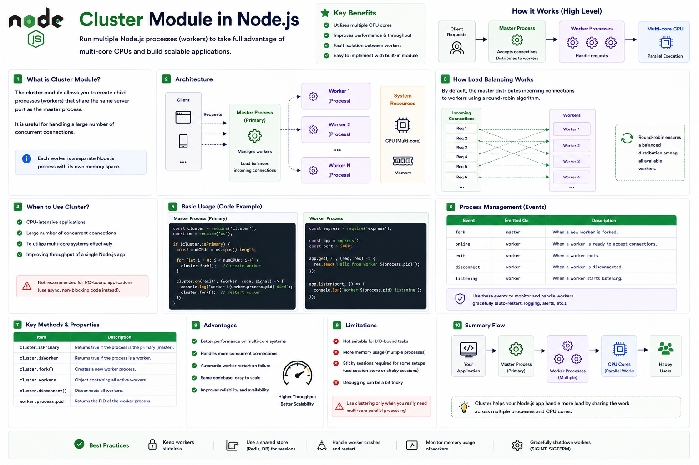

Your Node.js server is running on a machine with **8 CPU cores**...

But your application is only using **1 core**.

The other **7 cores are sitting idle.** 😯

Why?

Because a single Node.js process runs JavaScript on a **single main thread**.

To take advantage of multiple CPU cores, Node.js provides the **Cluster Module**.

Let's understand how it works. 👇

---

# What is the Cluster Module?

The **Cluster Module** allows you to create **multiple Node.js processes (workers)** that all share the same server port.

Instead of handling every request with a single process, incoming requests are distributed across multiple worker processes.

This lets your application utilize multiple CPU cores and handle more concurrent traffic.

---

# Why Do We Need It?

Imagine a server with **8 CPU cores**.

Without clustering:

```text id="k8r3mx"
CPU 1 ✅ Busy

CPU 2 😴 Idle

CPU 3 😴 Idle

CPU 4 😴 Idle

CPU 5 😴 Idle

CPU 6 😴 Idle

CPU 7 😴 Idle

CPU 8 😴 Idle
```

Only one Node.js process is serving requests.

With clustering:

```text id="n5v7qp"
CPU 1 ✅

CPU 2 ✅

CPU 3 ✅

CPU 4 ✅

CPU 5 ✅

CPU 6 ✅

CPU 7 ✅

CPU 8 ✅
```

Multiple worker processes share the workload.

---

# How the Cluster Module Works

When clustering is enabled:

```text id="v2m9lk"
Client Requests
        │
        ▼
Primary Process
        │
Creates Workers
        │
        ▼
Worker 1
Worker 2
Worker 3
Worker 4
        │
        ▼
Handle Requests
```

The **primary process** manages worker processes.

The **workers** run your application and process incoming requests.

---

# Primary Process vs Worker Process

### 🟢 Primary Process

Responsibilities:

✅ Creates workers

✅ Monitors workers

✅ Restarts crashed workers (if you choose to implement that logic)

✅ Coordinates the cluster

The primary process doesn't typically handle application requests itself.

---

### 🔵 Worker Process

Each worker:

* Runs its own Node.js instance
* Has its own Event Loop
* Has its own V8 engine
* Has its own memory

Every worker can process requests independently.

---

# Creating Workers

Node.js can create multiple workers based on the available CPU cores.

Example:

```javascript id="h4x7qp"
const os = require("os");

const cpuCount =
  os.availableParallelism();
```

Then:

```javascript id="q9m3vr"
for (
  let i = 0;
  i < cpuCount;
  i++
) {
  cluster.fork();
}
```

This starts one worker per available CPU core.

---

# Request Flow

Imagine four workers.

Incoming requests might be distributed like this:

```text id="t6p2kw"
Request 1 → Worker 1

Request 2 → Worker 2

Request 3 → Worker 3

Request 4 → Worker 4

Request 5 → Worker 1

...
```

The workload is spread across processes instead of overloading a single one.

---

# Fault Tolerance

One major advantage of clustering:

If one worker crashes:

```text id="y3n8jc"
Worker 3 ❌
```

The other workers continue serving requests.

The primary process can also create a replacement worker, improving application availability.

---

# Cluster vs Worker Threads

Developers often confuse these.

### 🧵 Worker Threads

✅ Multiple threads inside the same process

✅ Share the same process

✅ Best for CPU-intensive JavaScript tasks

---

### ⚙️ Cluster Module

✅ Multiple Node.js processes

✅ Separate memory

✅ Better isolation

✅ Best for scaling servers across CPU cores

---

# Cluster vs Child Processes

Both create new processes.

The difference:

### Child Process

➡️ Usually created to run a specific task or external program.

---

### Cluster

➡️ Specifically designed to run multiple instances of the same Node.js server and distribute incoming connections.

---

# When Should You Use It?

The Cluster Module is useful for:

✅ HTTP servers

✅ REST APIs

✅ Express applications

✅ Fastify applications

✅ High-traffic backend services

Whenever you want a single application to utilize multiple CPU cores.

---

# When Should You NOT Use It?

Avoid clustering when:

❌ Your application doesn't receive enough traffic to benefit.

❌ You're already scaling horizontally with containers or multiple instances behind a load balancer.

❌ Your application stores session state in process memory without a shared session store.

Modern deployments on platforms like Kubernetes, Docker Swarm, or cloud load balancers often scale by running multiple application instances instead of using the Cluster module.

---

# Best Practices

✅ Create workers based on `os.availableParallelism()`.

✅ Keep workers stateless when possible.

✅ Store sessions in shared storage (Redis, database, etc.).

✅ Restart crashed workers.

✅ Monitor worker health and resource usage.

---

# Common Mistakes

❌ Assuming workers share memory.

❌ Storing application state in a single worker.

❌ Creating more workers than available CPU resources.

❌ Ignoring worker crashes.

❌ Using clustering to solve CPU-heavy computations (consider Worker Threads for those).

---

# A Simple Way to Remember

🟢 **Primary Process** → Manages workers.

🔵 **Workers** → Handle client requests.

💻 **CPU Cores** → Run workers in parallel.

⚡ **Cluster Module** → Scales your Node.js server across multiple CPU cores.

Think of a restaurant.

👨‍💼 **Primary Process** = The manager assigning customers.

👨‍🍳 **Workers** = Multiple chefs preparing orders.

🍽️ Customers don't all wait for one chef.

Instead, the manager distributes orders so several chefs can work at the same time.

That's exactly how the Cluster Module helps your Node.js application serve more users efficiently.

Have you ever deployed a clustered Node.js application?

👇 Or do you prefer scaling with containers and load balancers?

#NodeJS #JavaScript #Cluster #Backend #WebDevelopment #Performance #Scalability #SoftwareEngineering #NodeInternals #SystemDesign

