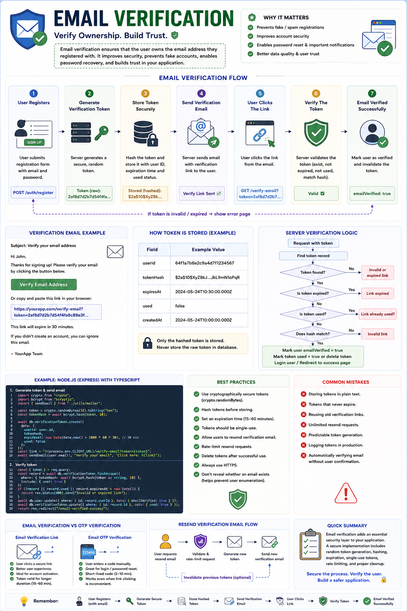

Have you ever wondered what happens after you click **"Verify Your Email"**?

You receive an email...
Click a link...
And suddenly your account becomes verified. ✅

It feels simple.

But behind the scenes, a secure verification workflow ensures that the email actually belongs to you.

**Email Verification** is one of the most important security features in modern applications. It prevents fake accounts, reduces spam, and ensures users can recover their accounts later.

Here's how it works.

---

## Email Verification Flow

### 1️⃣ User Registers

The user submits their information.

```text
Name: John Doe
Email: john@example.com
Password: ********
```

The backend validates the request and creates a new user.

However...

Instead of marking the account as verified:

```json
{
  "emailVerified": false
}
```

The account remains **unverified** until the user confirms ownership of the email address.

---

### 2️⃣ Generate a Verification Token

The server creates a secure, random token.

Example:

```text
2af8d7d2b7d54f4fa...
```

The token should be:

✅ Cryptographically random

✅ Unique

✅ Hard to guess

✅ Single-use

---

### 3️⃣ Store the Token Securely

Never store the verification token in plain text.

Instead:

* Hash the token
* Store:

  * User ID
  * Token Hash
  * Expiration Time
  * Used Status

Example:

```json
{
  "userId": "...",
  "tokenHash": "...",
  "expiresAt": "...",
  "used": false
}
```

If your database is compromised, attackers still can't use the original verification links.

---

### 4️⃣ Send the Verification Email

The backend sends an email containing a verification link.

Example:

```text
https://yourapp.com/verify-email?token=2af8d7d2...
```

Popular providers include:

📧 Resend

📧 SendGrid

📧 Amazon SES

📧 Mailgun

The frontend never generates this link.

Only the server should.

---

### 5️⃣ User Clicks the Link

The browser sends a request like:

```http
GET /verify-email?token=...
```

The backend receives the token and begins verification.

---

### 6️⃣ Verify the Token

The server checks:

✅ Does the token exist?

✅ Is it expired?

✅ Has it already been used?

✅ Does the hashed token match?

If everything is valid:

✔ Mark the user as verified

```json
{
  "emailVerified": true
}
```

✔ Delete or invalidate the verification token

✔ Allow access to verified-only features

---

### 7️⃣ User Can Now Access the Application

After successful verification, the account is fully activated.

Many applications now:

* Automatically log the user in
* Redirect to the dashboard
* Issue a Session or JWT

---

## Why Verify Email Addresses?

Without email verification, users can:

❌ Register using fake emails

❌ Create spam accounts

❌ Prevent legitimate users from registering their own email later

❌ Lose access to password recovery

Email verification improves both **security** and **data quality**.

---

## Best Practices

✅ Generate cryptographically secure tokens.

✅ Hash verification tokens before storing them.

✅ Make tokens **single-use**.

✅ Set an expiration time (typically **15–60 minutes**).

✅ Allow users to resend verification emails.

✅ Rate-limit the resend endpoint.

✅ Delete verification tokens after use.

✅ Always use HTTPS.

---

## Common Mistakes

❌ Storing tokens in plain text

❌ Tokens that never expire

❌ Reusing old verification links

❌ Unlimited resend requests

❌ Predictable token generation

❌ Logging verification tokens in production

❌ Automatically trusting any email without verification

---

## Email Verification vs OTP Verification

📧 **Email Verification Link**

• User clicks a secure link

• Better user experience

• Ideal for account activation

• Token usually valid for 15–60 minutes

🔢 **Email OTP Verification**

• User manually enters a code

• Great for login and password reset

• Better when link clicking isn't convenient

Both approaches verify email ownership, but they're optimized for different use cases.

---

## Bonus Security Tips

🔒 Don't reveal whether an email already exists when it's unnecessary.

🔒 Invalidate previous verification tokens when generating a new one.

🔒 Prevent multiple active verification tokens for the same account.

🔒 Monitor failed verification attempts.

🔒 Require verification before accessing sensitive features.

---

Email verification isn't just about sending an email.

A production-ready implementation includes **secure token generation, hashing, expiration, single-use tokens, rate limiting, and proper cleanup**.

Those details make the difference between a feature that works and one that's secure.

How do you implement email verification in your applications?

🔹 Verification Link

🔹 OTP

🔹 Magic Link

🔹 Another approach?

👇 Share your thoughts!

#NodeJS #JavaScript #Backend #Authentication #EmailVerification #CyberSecurity #ExpressJS #JWT #SoftwareEngineering #WebDevelopment
