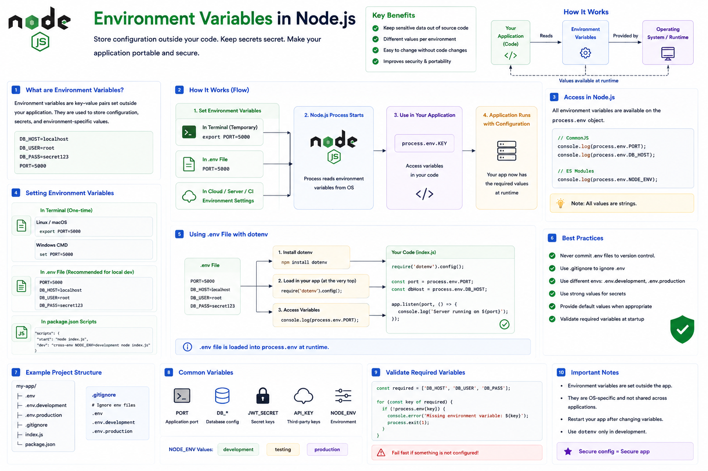

Have you ever seen code like this?

```javascript id="m4k9pz"
const dbPassword =
  "my-secret-password";
```

It might work...

But it's also one of the biggest security mistakes you can make.

What happens if your code is pushed to GitHub?

🚨 Your secrets are exposed.

That's why every production application uses **Environment Variables**.

Let's understand why they're essential. 👇

---

# What are Environment Variables?

**Environment Variables** are key-value pairs stored **outside your application code**.

Instead of hardcoding sensitive or environment-specific values, your application reads them at runtime.

Examples:

* Database URL
* API Keys
* JWT Secret
* Port Number
* Cloud Credentials

This keeps your code portable, configurable, and more secure.

---

# How They Work

Instead of writing:

```javascript id="r7n3vx"
const PORT = 5000;

const JWT_SECRET =
  "secret123";
```

Store them outside your code:

```env id="b2p6kw"
PORT=5000

JWT_SECRET=mySecretKey
```

Then access them inside your application:

```javascript id="g8m5ty"
console.log(
  process.env.PORT
);

console.log(
  process.env.JWT_SECRET
);
```

Node.js automatically exposes environment variables through the `process.env` object.

---

# Why Use Environment Variables?

Keeping configuration outside your code provides several benefits:

✅ Protect sensitive information

✅ Different values for different environments

✅ Easier deployment

✅ No code changes when configuration changes

This is why they're considered a best practice in modern backend development.

---

# Common Environment Variables

Typical examples include:

```env id="j5x8qr"
PORT=5000

NODE_ENV=production

DATABASE_URL=...

JWT_SECRET=...

API_KEY=...
```

These values often change between development, testing, and production.

---

# Development vs Production

Your development environment may use:

```env id="q9v2mc"
NODE_ENV=development
```

Production:

```env id="c6r4zh"
NODE_ENV=production
```

Your code stays the same.

Only the configuration changes.

---

# Using a `.env` File

During local development, many projects store variables in a `.env` file.

Example:

```env id="w1m7kp"
PORT=3000

DB_HOST=localhost

JWT_SECRET=...
```

Libraries such as `dotenv` can load these values into `process.env` when your application starts.

> Many deployment platforms (like cloud providers and container orchestrators) let you configure environment variables directly, so a `.env` file is often used only for local development.

---

# Accessing Variables

Example:

```javascript id="t3n8fy"
const port =
  process.env.PORT;

const db =
  process.env.DATABASE_URL;
```

One important detail:

All values in `process.env` are **strings**.

If you expect a number or boolean, convert it explicitly.

Example:

```javascript id="h7q5lw"
const port =
  Number(process.env.PORT);
```

---

# Real-World Use Cases

Environment Variables are commonly used for:

🔐 JWT secrets

🗄️ Database credentials

📧 Email configuration

☁️ Cloud service keys

💳 Payment gateway credentials

🌍 API endpoints

They're the standard way to configure applications across environments.

---

# Best Practices

✅ Keep secrets outside your source code.

✅ Add `.env` to `.gitignore`.

✅ Validate required environment variables during application startup.

✅ Use meaningful variable names.

✅ Store production secrets in your hosting platform's secret manager or environment configuration.

---

# Common Mistakes

❌ Committing `.env` files containing secrets to Git.

❌ Hardcoding passwords or API keys.

❌ Assuming environment variables always exist.

❌ Forgetting that `process.env` values are strings.

❌ Logging sensitive values like tokens or secrets.

---

# `.env` vs `process.env`

Developers often confuse these.

### `.env`

📄 A file used to define environment variables, typically for local development.

---

### `process.env`

⚙️ A JavaScript object that gives your application access to environment variables at runtime.

Think of it like this:

`.env` stores the values.

`process.env` reads the values.

---

# A Simple Way to Remember

📄 **`.env`** → Stores configuration.

⚙️ **`process.env`** → Accesses configuration.

🔐 **Secrets** → Keep them outside your code.

🚀 **Deployments** → Change configuration without changing code.

Think of Environment Variables as your application's **control panel**.

Instead of editing your source code every time you switch from development to production, you simply change the configuration.

That's what makes modern applications secure, portable, and easy to deploy.

Do you use a `.env` file in every project?

👇 What's the most important environment variable in your backend applications?

#NodeJS #JavaScript #Backend #EnvironmentVariables #DotEnv #WebDevelopment #Programming #SoftwareEngineering #NodeInternals #ExpressJS


