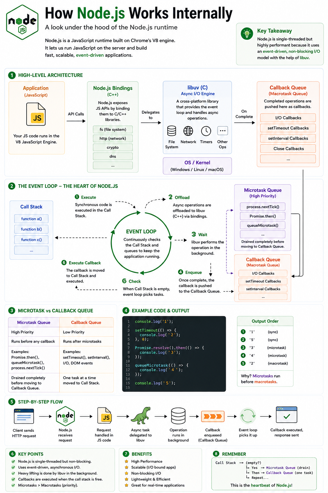

One of the biggest misconceptions about JavaScript is:

> **"JavaScript is asynchronous."**

It's not.

JavaScript is **single-threaded and synchronous**.

So how can it handle timers, API requests, file uploads, and thousands of concurrent operations without blocking?

The answer is the **Event Loop**.

If you understand the Event Loop, you'll understand how asynchronous JavaScript really works.

Let's break it down. 👇

---

## What is the Event Loop?

The **Event Loop** is a mechanism that continuously checks whether JavaScript is ready to execute asynchronous callbacks.

It acts as the **bridge** between synchronous JavaScript execution and asynchronous operations.

Without the Event Loop, features like:

* `setTimeout()`
* `fetch()`
* `Promises`
* Database queries
* File system operations

wouldn't work the way they do today.

---

## The Main Components

The Event Loop works together with several components:

🟦 Call Stack

🟩 Web APIs / Node.js APIs

🟪 Microtask Queue

🟨 Callback Queue (Macrotask Queue)

🔄 Event Loop

Each has a different responsibility.

---

## Step 1 — Call Stack

Every synchronous function executes inside the **Call Stack**.

Example:

```javascript id="u4j7kp"
console.log("Start");

console.log("End");
```

Execution:

```text id="e8m2qy"
Call Stack

console.log("Start")

console.log("End")
```

The stack executes one function at a time.

---

## Step 2 — Async Operations

When JavaScript encounters an asynchronous task:

```javascript id="t2f8mw"
setTimeout(() => {
  console.log("Timer");
}, 1000);
```

It doesn't wait.

Instead:

```text id="j7n4cv"
JavaScript
      │
      ▼
Web API / Node API
```

The timer runs outside the Call Stack.

Meanwhile, JavaScript continues executing the remaining code.

---

## Step 3 — Callback is Queued

When the timer finishes:

Its callback is placed into the **Callback Queue**.

It still doesn't execute immediately.

It must wait until the Call Stack becomes empty.

---

## Step 4 — Microtasks

Promise callbacks are different.

Example:

```javascript id="g9r5ya"
Promise.resolve().then(() => {
  console.log("Promise");
});
```

This callback goes into the **Microtask Queue**, which has **higher priority** than the Callback Queue.

Microtasks include:

* `Promise.then()`
* `Promise.catch()`
* `Promise.finally()`
* `queueMicrotask()`
* `process.nextTick()` *(Node.js-specific, even higher priority than other microtasks)*

---

## Step 5 — Event Loop

The Event Loop continuously asks:

> "Is the Call Stack empty?"

If the answer is **Yes**:

1️⃣ Execute **all Microtasks**.

2️⃣ Execute **one Callback Queue task**.

3️⃣ Repeat forever.

This simple rule explains almost every asynchronous behavior in JavaScript.

---

## Execution Priority

```text id="z4c1tx"
Synchronous Code
        ↓
process.nextTick() (Node.js)
        ↓
Microtask Queue
(Promises)
        ↓
Callback Queue
(setTimeout, I/O, setInterval)
```

Always remember:

**Microtasks are processed before Callback Queue tasks.**

---

## Example

```javascript id="h8v2lp"
console.log("1");

setTimeout(() => {
  console.log("2");
}, 0);

Promise.resolve().then(() => {
  console.log("3");
});

console.log("4");
```

---

### Execution

First:

```text id="x6n5br"
1
4
```

Then the Call Stack becomes empty.

The Event Loop checks the **Microtask Queue**.

Output:

```text id="d7q8sk"
1
4
3
```

Finally, it processes the **Callback Queue**.

Final Output:

```text id="m2p4jc"
1
4
3
2
```

This is why:

```javascript id="w5f9ey"
Promise.then()
```

always runs before:

```javascript id="q3z8na"
setTimeout(..., 0)
```

---

## Event Loop in Node.js

In browsers, asynchronous tasks are handled by **Web APIs**.

In Node.js, they're handled by **libuv**, which manages:

* File System
* Networking
* Timers
* Thread Pool
* Event Loop

This allows Node.js to process thousands of I/O operations efficiently without blocking the main thread.

---

## Why the Event Loop Matters

Without the Event Loop:

❌ Every file read would block the application.

❌ Every database query would freeze execution.

❌ Every HTTP request would wait for the previous one to finish.

Instead, JavaScript keeps executing other work while asynchronous tasks run in the background.

---

## Common Mistakes

❌ Thinking JavaScript is multi-threaded.

❌ Assuming `setTimeout(..., 0)` runs immediately.

❌ Forgetting that Promises are Microtasks.

❌ Ignoring `process.nextTick()` priority in Node.js.

❌ Blocking the Event Loop with CPU-intensive work.

---

## Best Practices

✅ Keep synchronous work lightweight.

✅ Avoid long-running CPU-bound tasks on the main thread.

✅ Use asynchronous APIs whenever possible.

✅ Understand Microtask vs Callback Queue priorities.

✅ Use Worker Threads for CPU-intensive workloads in Node.js.

---

## A Simple Way to Remember

📚 **Call Stack** → Executes synchronous code.

⚙️ **Web APIs / libuv** → Handle asynchronous operations.

⚡ **Microtask Queue** → Promise callbacks and other high-priority tasks.

📥 **Callback Queue** → Timers, I/O, and other macrotasks.

🔄 **Event Loop** → Moves ready tasks back to the Call Stack when it's free.

The Event Loop is the heartbeat of JavaScript.

It's the reason a single-threaded language can build fast, scalable applications without blocking on I/O.

Once you truly understand the Event Loop, async JavaScript becomes far less mysterious.

What's the concept that confused you the most when learning the Event Loop?

🔹 Call Stack

🔹 Promises

🔹 Microtasks

🔹 `setTimeout()`

🔹 `process.nextTick()`

👇 Share your answer!

#JavaScript #EventLoop #NodeJS #Promises #AsyncAwait #WebDevelopment #Frontend #Backend #Programming #SoftwareEngineering


