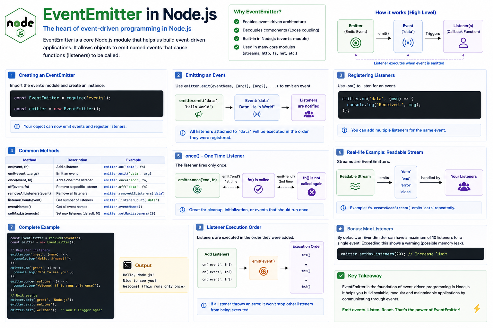

How does Node.js know when:

📁 A file has finished reading?

🌐 An HTTP request arrives?

🔌 A client connects to your server?

🌊 A stream receives new data?

The answer is **events**.

And the core mechanism behind Node.js's event-driven architecture is the **EventEmitter**.

If you've ever used Express, Streams, HTTP, or WebSockets, you've already used EventEmitter—even if you didn't realize it.

Let's explore how it works. 👇

---

## What is EventEmitter?

**EventEmitter** is a built-in Node.js class that allows objects to **emit events** and other parts of your application to **listen** for those events.

Think of it as a communication system.

One object announces that something happened.

Other objects react to it.

This pattern helps keep your code modular and loosely coupled.

---

## How It Works

The flow is simple:

```text id="t6k9pw"
Event Occurs
      │
      ▼
Emitter emits event
      │
      ▼
Registered Listener(s)
      │
      ▼
Execute Callback
```

Instead of continuously checking whether something has happened, your code simply waits for an event.

---

## Creating an EventEmitter

Node.js provides the `events` module.

Example:

```javascript id="h2m8qx"
const EventEmitter = require("events");

const emitter = new EventEmitter();
```

Now you can create your own custom events.

---

## Listening for Events

Use `.on()` to register a listener.

```javascript id="g7v4nd"
emitter.on("login", (user) => {
  console.log(`${user} logged in`);
});
```

Nothing happens yet.

The listener is simply waiting.

---

## Emitting an Event

Use `.emit()` to trigger an event.

```javascript id="y5p3lr"
emitter.emit("login", "John");
```

Output:

```text id="m8c6zw"
John logged in
```

Every listener attached to the `"login"` event is executed.

---

## Multiple Listeners

One event can have multiple listeners.

```javascript id="n4q2ft"
emitter.on("order", () => {
  console.log("Save order");
});

emitter.on("order", () => {
  console.log("Send email");
});

emitter.on("order", () => {
  console.log("Update inventory");
});
```

Then:

```javascript id="w9r7jk"
emitter.emit("order");
```

Output:

```text id="p3x5sv"
Save order

Send email

Update inventory
```

One event can trigger multiple independent actions.

---

## One-Time Events

Sometimes an event should only execute once.

Use:

```javascript id="z1h8mb"
emitter.once("start", () => {
  console.log("Application started");
});
```

Even if:

```javascript id="q8f6cn"
emitter.emit("start");

emitter.emit("start");
```

Only the first event runs.

---

## Common EventEmitter Methods

| Method                 | Purpose              |
| ---------------------- | -------------------- |
| `on()`                 | Register a listener  |
| `once()`               | Listen only once     |
| `emit()`               | Trigger an event     |
| `off()`                | Remove a listener    |
| `removeAllListeners()` | Remove all listeners |
| `listenerCount()`      | Count listeners      |

These methods provide everything needed for event-driven communication.

---

## Where is EventEmitter Used?

Many core Node.js modules extend EventEmitter.

Examples:

📁 File Streams

🌐 HTTP Server

🔌 TCP Sockets

📦 Streams

📡 WebSockets

Child Processes

Whenever you write:

```javascript id="k3v7py"
stream.on("data", ...)
```

or

```javascript id="u5m1dz"
server.on("request", ...)
```

you're using EventEmitter.

---

## Real-World Example

Imagine an e-commerce application.

Customer places an order.

Instead of one huge function handling everything:

```text id="e7j9ra"
Order Created
      │
      ▼
Emit "orderCreated"
      │
 ┌────┼────────┐
 ▼    ▼        ▼
Email Inventory Analytics
```

Each service listens for the same event.

They don't depend directly on one another.

This makes the application easier to extend and maintain.

---

## Why EventEmitter Matters

Without events:

❌ Components become tightly coupled.

❌ Large functions handle multiple responsibilities.

❌ Adding new features becomes difficult.

With EventEmitter:

✅ Loose coupling

✅ Better modularity

✅ Easier maintenance

✅ Reusable components

This is one of the reasons Node.js scales so well for event-driven applications.

---

## Best Practices

✅ Use descriptive event names.

✅ Keep listeners focused on one responsibility.

✅ Remove listeners when they're no longer needed.

✅ Handle the `"error"` event on custom emitters when appropriate.

✅ Avoid adding an excessive number of listeners to the same event unless there's a clear need.

---

## Common Mistakes

❌ Forgetting to register listeners before emitting events.

❌ Creating circular event chains.

❌ Doing heavy CPU work inside listeners.

❌ Ignoring the `"error"` event, which can cause the process to throw if emitted without a listener.

---

## A Simple Way to Remember

📢 **Emitter** → Announces that something happened.

👂 **Listener** → Waits for the event.

⚡ **emit()** → Triggers the event.

🎯 **on()** → Reacts to the event.

Think of it like a YouTube notification.

🎥 A creator uploads a video.

🔔 You subscribed.

📲 You instantly receive a notification.

The creator doesn't know who is listening—they simply publish the event.

That's exactly how EventEmitter works.

It's the foundation of Node.js's event-driven architecture and one of the reasons the platform is so powerful for building scalable backend applications.

Have you ever created your own custom events with EventEmitter, or have you mostly used it indirectly through Node.js modules?

👇 Share your experience!

#NodeJS #JavaScript #EventEmitter #Backend #WebDevelopment #Programming #SoftwareEngineering #SystemDesign #EventDriven #ExpressJS


