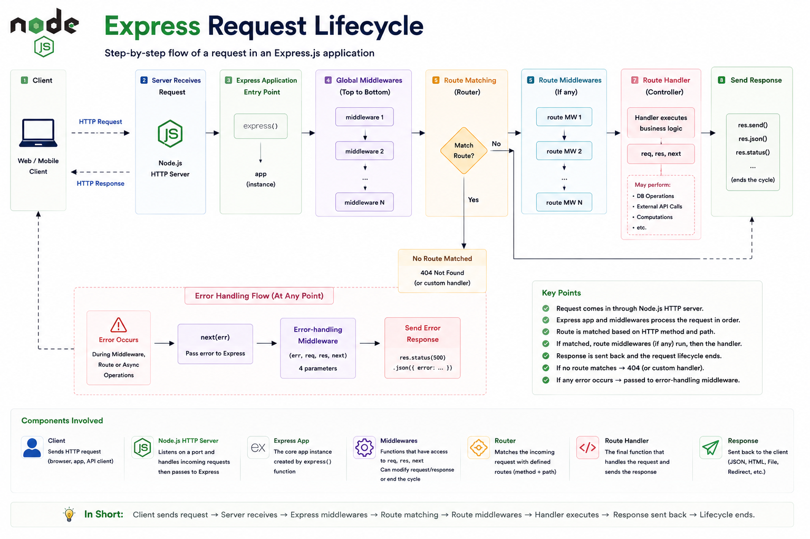

Have you ever wondered what actually happens **after a client sends an HTTP request to your Express server?**

A request doesn't jump directly to your route handler.

Instead, it passes through several stages before a response is sent back.

Understanding the **Express Request Lifecycle** is one of the most important concepts for every backend developer.

Let's break it down. 👇

---

# What is the Express Request Lifecycle?

The **Express Request Lifecycle** is the complete journey of an HTTP request—from the moment it reaches your server until a response is returned to the client.

Every request typically goes through:

✅ Express Application

✅ Middlewares

✅ Route Matching

✅ Route Handler (Controller)

✅ Error Handler (if needed)

✅ Response

Knowing this flow makes debugging and designing Express applications much easier.

---

# The Complete Flow

```text id="w3m8qp"
Client
   │
HTTP Request
   │
   ▼
Express App
   │
Global Middleware
   │
Route Matching
   │
Route Middleware
   │
Controller
   │
Business Logic
   │
Database / API
   │
Response
   │
   ▼
Client
```

If an error occurs at any point, Express can redirect the flow to an error-handling middleware.

---

# Step 1: Client Sends a Request

Everything starts with an HTTP request.

Example:

```http id="v9q4lt"
GET /users
```

The request reaches the Node.js HTTP server, which passes it to your Express application.

---

# Step 2: Express Receives the Request

When you create:

```javascript id="r2k7mx"
const app = express();
```

Express creates an application that listens for incoming requests and begins processing them.

---

# Step 3: Global Middleware

Before reaching any route, the request passes through middleware registered with `app.use()`.

Examples:

```javascript id="h5p8zy"
app.use(express.json());

app.use(logger);

app.use(cors());
```

Common tasks include:

✅ Parsing JSON

✅ Logging requests

✅ Authentication

✅ Security headers

Each middleware decides whether to continue by calling `next()` or end the request by sending a response.

---

# Step 4: Route Matching

Express checks:

* HTTP Method
* Request URL

Example:

```javascript id="x7m3kr"
app.get("/users", ...);
```

A request like:

```http id="q4v6np"
GET /users
```

matches this route.

If no route matches, Express typically returns a **404 Not Found** response.

---

# Step 5: Route Middleware

Some routes have middleware that only applies to that specific endpoint.

Example:

```javascript id="m8t2qw"
app.get(
  "/profile",
  authMiddleware,
  controller
);
```

Here, `authMiddleware` runs before the controller.

It's commonly used for:

🔐 Authentication

🛡️ Authorization

✅ Validation

📊 Rate limiting

---

# Step 6: Route Handler (Controller)

Once the request passes all middleware, it reaches the controller.

Example:

```javascript id="p6k9zr"
app.get(
  "/users",
  async (req, res) => {
    // Business logic
  }
);
```

The controller typically:

* Reads request data
* Calls services
* Interacts with the database
* Returns a response

Keep controllers focused on coordinating the request rather than containing all business logic.

---

# Step 7: Business Logic

Most real-world applications separate business logic into services.

Example flow:

```text id="n5r7tx"
Controller
      │
      ▼
Service
      │
      ▼
Database
```

This makes your code:

✅ Easier to test

✅ Easier to reuse

✅ Easier to maintain

---

# Step 8: Send Response

Finally:

```javascript id="g3m8pv"
res.json(data);
```

or

```javascript id="z8q2lh"
res.send("Success");
```

Express sends the HTTP response, and the request lifecycle ends.

Once a response is sent, no additional middleware or route handlers should attempt to send another response.

---

# What Happens When an Error Occurs?

If an error is passed to `next(err)` or thrown inside an async route (and properly handled), Express can invoke an error-handling middleware.

Example:

```javascript id="t4v7mn"
app.use(
  (
    err,
    req,
    res,
    next
  ) => {
    res
      .status(500)
      .json({
        message:
          "Something went wrong",
      });
  }
);
```

Centralized error handling keeps responses consistent and avoids duplicating error logic across routes.

---

# Common Middlewares

Typical middleware in Express applications:

📦 `express.json()`

📝 Request logger

🔐 Authentication

🛡️ Authorization

🌐 CORS

⚡ Rate limiting

❌ Global error handler

Each middleware has a specific responsibility in the request lifecycle.

---

# Best Practices

✅ Keep middleware focused on a single responsibility.

✅ Move business logic into service layers.

✅ Validate request data before executing business logic.

✅ Handle errors centrally.

✅ Return consistent response formats.

---

# Common Mistakes

❌ Forgetting to call `next()` when middleware should continue.

❌ Sending multiple responses for the same request.

❌ Putting all business logic inside route handlers.

❌ Skipping input validation.

❌ Returning different error formats across endpoints.

---

# A Simple Way to Remember

📨 **Request** → Client sends an HTTP request.

⚙️ **Middleware** → Processes the request.

🛣️ **Route** → Finds the correct endpoint.

🧠 **Controller** → Coordinates business logic.

🗄️ **Service/Database** → Performs the actual work.

📤 **Response** → Sends data back to the client.

Think of Express like an airport.

🧍 **Client** = Passenger.

🛂 **Middleware** = Security checks.

🛫 **Route** = Boarding gate assignment.

👨‍✈️ **Controller** = Pilot operating the flight.

🏁 **Response** = Passenger arrives at the destination.

Every request follows a journey, and understanding that journey helps you build cleaner, more scalable Express applications.

At which stage of the Express request lifecycle have you spent the most time debugging?

👇 Let me know!

#NodeJS #ExpressJS #JavaScript #Backend #WebDevelopment #Programming #SoftwareEngineering #RESTAPI #FullStack #NodeInternals


