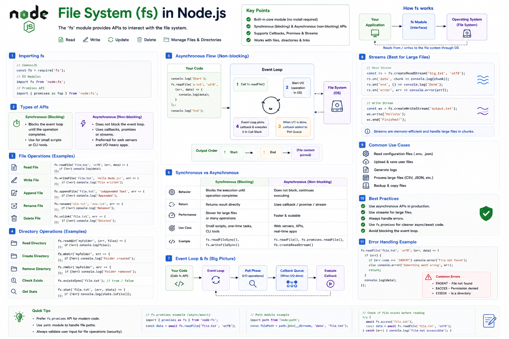

Every backend application works with files.

Whether you're:

📄 Reading a configuration file

📸 Uploading user images

📝 Writing logs

📊 Processing CSV or JSON files

📦 Creating backups

...you'll eventually use the **File System (`fs`) module**.

It's one of the most important built-in modules in Node.js.

Let's understand how it works. 👇

---

# What is the `fs` Module?

The **File System (`fs`) module** is a built-in Node.js module that lets your application interact with the operating system's file system.

Using `fs`, you can:

✅ Read files

✅ Write files

✅ Create directories

✅ Rename files

✅ Delete files

✅ Check file information

No additional installation is required.

---

# Importing the Module

### CommonJS

```javascript id="n4j7tp"
const fs = require("fs");
```

---

### ES Modules

```javascript id="z8m2qy"
import fs from "node:fs";
```

For Promise-based APIs:

```javascript id="w3f6lk"
import { promises as fs } from "node:fs";
```

The `node:` prefix explicitly indicates that you're importing a built-in Node.js module.

---

# How the File System Works

When your application reads a file:

```text id="k5v9rd"
Your Code
      │
      ▼
fs Module
      │
      ▼
Operating System
      │
      ▼
File System
      │
      ▼
Return Result
```

The `fs` module acts as a bridge between your JavaScript code and the operating system.

---

# Reading Files

One of the most common operations.

```javascript id="c2x8mv"
fs.readFile(
  "data.txt",
  "utf8",
  (err, data) => {
    if (err) return;

    console.log(data);
  }
);
```

The file is read asynchronously, allowing the Event Loop to continue processing other tasks.

---

# Writing Files

```javascript id="y6p4nt"
fs.writeFile(
  "output.txt",
  "Hello Node.js",
  (err) => {
    if (err) return;

    console.log("Done");
  }
);
```

If the file doesn't exist, Node.js creates it.

If it already exists, its contents are replaced.

---

# Appending Data

Instead of replacing the file:

```javascript id="m8r1zw"
fs.appendFile(
  "log.txt",
  "New Log\n",
  () => {}
);
```

The new content is added to the end.

Perfect for log files.

---

# Renaming Files

```javascript id="h4q7sk"
fs.rename(
  "old.txt",
  "new.txt",
  () => {}
);
```

Useful for versioning and file management.

---

# Deleting Files

```javascript id="j9v3pc"
fs.unlink(
  "temp.txt",
  () => {}
);
```

Deletes the file from disk.

---

# Working with Directories

Create a directory:

```javascript id="t2m8fx"
fs.mkdir(
  "uploads",
  () => {}
);
```

Read directory contents:

```javascript id="v5n6qy"
fs.readdir(
  "./uploads",
  (err, files) => {}
);
```

Directories are managed using the same module.

---

# Synchronous vs Asynchronous APIs

The `fs` module provides both synchronous and asynchronous methods.

### Synchronous

```javascript id="p7k4ld"
const data =
  fs.readFileSync(
    "data.txt",
    "utf8"
  );
```

Blocks the Event Loop until the operation finishes.

Good for:

* Small scripts
* CLI tools
* Startup configuration

---

### Asynchronous

```javascript id="r3x9mn"
fs.readFile(
  "data.txt",
  callback
);
```

Doesn't block the Event Loop.

Ideal for:

* APIs
* Servers
* Production applications

---

# Promise-based API

Modern Node.js applications often use the Promise-based API.

```javascript id="g6w2zb"
const data =
  await fs.readFile(
    "data.txt",
    "utf8"
  );
```

This works naturally with `async`/`await`, making code easier to read and maintain.

---

# Streams for Large Files

Reading an entire 5 GB file into memory isn't efficient.

Instead:

```javascript id="u8f5hr"
const stream =
  fs.createReadStream(
    "movie.mp4"
  );
```

Streams process the file chunk by chunk.

Benefits:

✅ Lower memory usage

✅ Faster processing

✅ Better scalability

---

# Common Use Cases

📁 File uploads

📝 Application logs

📄 Configuration files

📊 CSV processing

🖼️ Image storage

📦 Backups

📂 Media streaming

Almost every backend application interacts with the file system in some way.

---

# Common Errors

You may encounter errors such as:

* `ENOENT` → File or directory doesn't exist.

* `EACCES` → Permission denied.

* `EISDIR` → Expected a file but found a directory.

Always handle errors gracefully to avoid unexpected crashes.

---

# Best Practices

✅ Prefer asynchronous APIs in servers.

✅ Use the Promise API with `async`/`await` for cleaner code.

✅ Use streams for large files.

✅ Handle file operation errors.

✅ Use the `path` module to build file paths instead of hardcoding separators.

---

# Common Mistakes

❌ Using synchronous methods inside API routes.

❌ Reading huge files with `readFile()` instead of streams.

❌ Ignoring error handling.

❌ Assuming files always exist.

❌ Building file paths manually with string concatenation.

---

# A Simple Way to Remember

📖 **readFile()** → Read a file.

✍️ **writeFile()** → Create or replace a file.

➕ **appendFile()** → Add content to the end.

🗑️ **unlink()** → Delete a file.

📂 **mkdir()** → Create a directory.

🌊 **createReadStream()** → Process large files efficiently.

Think of the `fs` module as your application's file manager.

Just like you use your operating system to create, read, move, and delete files, Node.js gives your code the ability to do the same programmatically.

Mastering the `fs` module is a foundational step toward building real-world backend applications.

Which `fs` method do you use most often?

🔹 `readFile()`

🔹 `writeFile()`

🔹 `createReadStream()`

🔹 `readdir()`

👇 Let me know!

#NodeJS #JavaScript #FileSystem #Backend #WebDevelopment #Programming #SoftwareEngineering #NodeInternals #ExpressJS #SystemDesign


