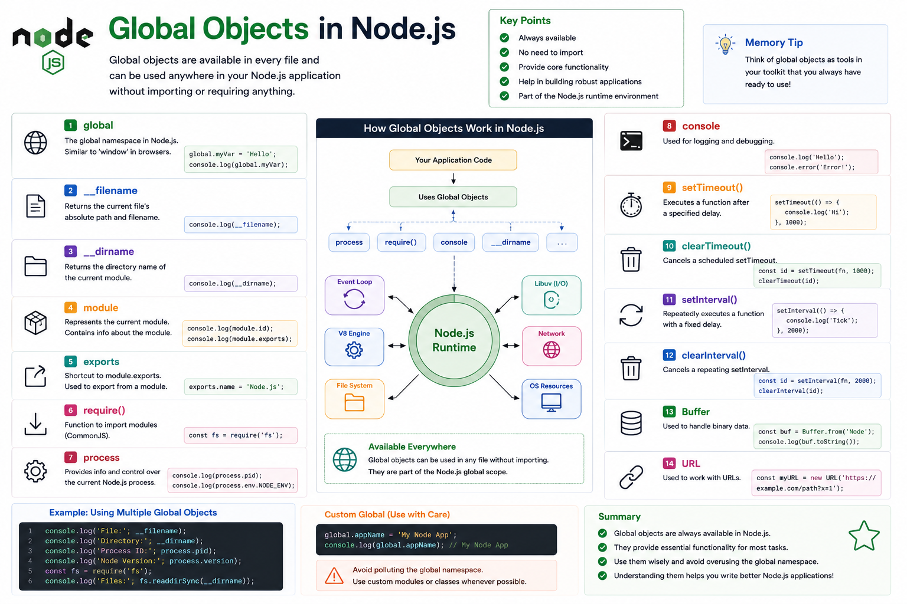

Have you noticed that some things in Node.js work **without importing anything**?

For example:

```javascript id="p7k4mz"
console.log("Hello");

setTimeout(() => {}, 1000);

process.pid;
```

No `import`.

No `require()`.

Yet they work perfectly.

That's because they're **Global Objects**.

Let's understand what they are and why they're important. 👇

---

## What are Global Objects?

Global Objects are objects, functions, and variables that are **available everywhere** in your Node.js application.

You can use them directly without importing a module.

Think of them as built-in tools that Node.js automatically provides.

---

## Why Do Global Objects Exist?

Imagine importing `console` every time you wanted to log something:

```javascript id="m3v9rt"
import console from "console";
```

That would be unnecessary.

Instead, Node.js exposes commonly used utilities globally to make development easier.

---

## Common Global Objects

Here are some of the most frequently used ones.

### 🖥️ `console`

Used for logging and debugging.

```javascript id="a6w2nk"
console.log("Hello");

console.error("Error");

console.table(users);
```

Probably the most used global object in every Node.js project.

---

### ⚙️ `process`

Provides information and control over the current Node.js process.

Example:

```javascript id="j8f5pd"
console.log(process.pid);

console.log(process.version);

console.log(process.platform);
```

You can also access environment variables:

```javascript id="g4q7xs"
process.env.PORT;
```

---

### ⏱️ Timers

Node.js provides timer functions globally.

Examples:

```javascript id="y2n8hv"
setTimeout();

setInterval();

setImmediate();

clearTimeout();

clearInterval();

clearImmediate();
```

No import required.

---

### 📦 `Buffer`

Used for handling binary data.

Example:

```javascript id="k9m3zf"
const buf = Buffer.from("Node");
```

Buffers are essential for:

* Files
* Streams
* Networking
* Binary protocols

---

### 🌍 `global`

The global namespace in Node.js.

Example:

```javascript id="t5r1bc"
global.appName = "My App";

console.log(global.appName);
```

While it's available, adding your own values to `global` is generally discouraged because it can make applications harder to maintain.

---

### 🌐 URL Utilities

Node.js also provides global classes such as:

```javascript id="u7x4ql"
const url = new URL(
  "https://example.com"
);
```

Useful for parsing and manipulating URLs.

---

## Module-Specific Globals

Some values look global because they're available in every CommonJS module, but they're actually **module-specific**, not truly global.

Examples include:

```javascript id="r8z6ty"
__dirname

__filename

exports

module

require
```

These are provided by Node.js when it wraps each CommonJS module.

Example:

```javascript id="q2v5mj"
console.log(__dirname);

console.log(__filename);
```

They help you work with the current file and module.

> **Note:** In ES Modules (`import`/`export`), `__dirname`, `__filename`, and `require()` are **not available** by default. You'll typically use `import.meta.url` and related utilities instead.

---

## How Global Objects Fit In

When your application starts:

```text id="h4c8pw"
Node.js Runtime
        │
        ▼
Creates Global Objects
        │
        ▼
Your Application
        │
Uses:
console
process
Buffer
setTimeout
...
```

These objects are ready before your code executes.

---

## Why They're Useful

Global Objects make development easier because they provide:

✅ Logging

✅ Process information

✅ Timers

✅ Binary data handling

✅ URL utilities

without requiring extra imports.

---

## Best Practices

✅ Use global objects when appropriate.

✅ Store configuration in `process.env`.

✅ Use `Buffer` for binary data.

✅ Prefer `console` for development logging.

✅ Be cautious when relying on globals across large codebases.

---

## Common Mistakes

❌ Polluting the `global` object with custom variables.

❌ Assuming CommonJS module variables like `__dirname` exist in ES Modules.

❌ Hardcoding configuration instead of using environment variables.

❌ Using `console.log()` as the only logging solution in production.

---

## Browser vs Node.js Globals

Many developers coming from frontend development confuse these.

### 🌐 Browser

Global object:

```javascript id="b3j9na"
window
```

or

```javascript id="m7p2qy"
globalThis
```

---

### 🟢 Node.js

The universal global object is:

```javascript id="x6v4kr"
globalThis
```

Node.js also exposes the legacy alias:

```javascript id="f1n8wc"
global
```

Both reference the global scope, but `globalThis` is the standard JavaScript global available across environments.

---

## A Simple Way to Remember

🖥️ **console** → Logging

⚙️ **process** → Information about the running Node.js process

⏱️ **Timers** → Schedule work

📦 **Buffer** → Handle binary data

🌍 **globalThis / global** → Global namespace

📁 **__dirname / __filename** → Information about the current CommonJS module

Think of Global Objects like the tools in a developer's toolbox.

You don't need to buy them every time you start a project.

They're already there, ready to use.

Understanding these built-in objects will make you more productive and help you write cleaner Node.js applications.

Which global object do you use the most?

🔹 `process`

🔹 `Buffer`

🔹 `console`

🔹 Timers

👇 Let me know!

#NodeJS #JavaScript #Backend #GlobalObjects #WebDevelopment #Programming #SoftwareEngineering #NodeInternals #ExpressJS #SystemDesign


