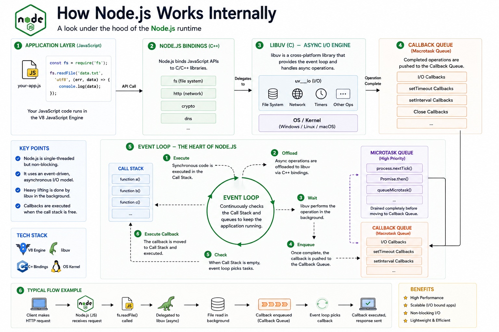

Have you ever wondered how **Node.js handles thousands of concurrent requests** even though JavaScript is **single-threaded**? 🤔

At first, it sounds impossible.

If JavaScript executes one task at a time, how can a Node.js server handle thousands of users simultaneously?

The answer lies in **V8**, **libuv**, the **Event Loop**, and the **Operating System**.

Let's look under the hood. 👇

---

## What is Node.js?

Node.js is **not a programming language**.

It's **not a JavaScript framework**.

Node.js is a **JavaScript runtime** built on Google's **V8 JavaScript Engine**.

It allows JavaScript to run **outside the browser**.

---

## The Main Components

A typical Node.js application consists of:

🟢 V8 JavaScript Engine

🟢 Node.js APIs

🟢 C++ Bindings

🟢 libuv

🟢 Event Loop

🟢 Operating System

Each component has a specific responsibility.

---

## 1️⃣ V8 JavaScript Engine

V8 is responsible for executing your JavaScript code.

It:

✅ Parses JavaScript

✅ Compiles it into machine code

✅ Executes synchronous code

Example:

```javascript id="6v9mxr"
console.log("Hello");
```

This code runs directly inside V8.

However...

V8 **cannot** perform:

* File System operations
* Network requests
* Database queries
* Timers

That's where Node.js comes in.

---

## 2️⃣ Node.js APIs

Node.js provides APIs like:

📁 File System (`fs`)

🌐 HTTP

🔒 Crypto

🖥️ DNS

⏰ Timers

These APIs are written in C/C++ and expose functionality that JavaScript alone cannot perform.

Example:

```javascript id="p2m5fd"
fs.readFile("users.json", callback);
```

---

## 3️⃣ C++ Bindings

When you call:

```javascript id="t4h8za"
fs.readFile(...)
```

JavaScript doesn't read the file directly.

Instead:

JavaScript

↓

C++ Binding

↓

libuv

↓

Operating System

The C++ bindings act as a bridge between JavaScript and the underlying system libraries.

---

## 4️⃣ libuv

**libuv** is the heart of Node.js's asynchronous capabilities.

It manages:

📁 File I/O

🌐 Network I/O

⏰ Timers

🔄 Event Loop

🧵 Thread Pool

Instead of blocking JavaScript while waiting for slow operations, libuv delegates them to the operating system or its internal thread pool.

This allows Node.js to keep processing other requests.

---

## 5️⃣ The Event Loop

The Event Loop continuously checks:

> "Is the Call Stack empty?"

If it is:

✔ Execute pending microtasks.

✔ Execute ready callbacks.

✔ Continue checking for more work.

The Event Loop is what keeps Node.js responsive.

Without it, asynchronous programming wouldn't exist.

---

## 6️⃣ Callback Queue & Microtask Queue

When an asynchronous operation finishes:

Its callback doesn't execute immediately.

Instead:

Completed task

↓

Queue

↓

Event Loop

↓

Call Stack

Important:

🟣 **Microtask Queue** (Promises, `queueMicrotask()`, `process.nextTick()`) is processed before

🟡 **Callback Queue** (`setTimeout`, I/O callbacks, `setInterval`).

---

## Example Flow

Suppose your application reads a file:

```javascript id="j7n2vy"
fs.readFile("data.txt", (err, data) => {
  console.log(data);
});
```

Behind the scenes:

```text id="n6k5sb"
JavaScript
      │
      ▼
V8 Engine
      │
      ▼
Node.js API
      │
      ▼
C++ Binding
      │
      ▼
libuv
      │
      ▼
Operating System
      │
(File Read)
      │
      ▼
Callback Queue
      │
      ▼
Event Loop
      │
      ▼
Call Stack
      │
      ▼
console.log(data)
```

Notice that JavaScript never waits for the file to finish reading.

It keeps executing other code.

---

## Why Node.js is Fast

Node.js is fast because it **doesn't wait** for I/O operations.

Instead of blocking:

❌ Read file...

❌ Wait...

❌ Continue...

It works like this:

✔ Start reading file

✔ Continue executing other requests

✔ Execute callback when the file is ready

This non-blocking model makes Node.js ideal for I/O-heavy applications.

---

## Where Node.js Excels

✅ REST APIs

✅ Real-time Chat Applications

✅ WebSockets

✅ Streaming Services

✅ Microservices

✅ API Gateways

✅ File Upload Services

---

## Where Node.js Isn't the Best Choice

Node.js is less suitable for CPU-intensive tasks like:

❌ Video encoding

❌ Large image processing

❌ Heavy mathematical computations

❌ Machine learning inference

These tasks can block the Event Loop and reduce performance.

---

## A Simple Way to Remember

🧠 **V8** → Executes JavaScript.

🔗 **C++ Bindings** → Connect JavaScript to native code.

⚡ **libuv** → Handles asynchronous operations.

🔄 **Event Loop** → Keeps checking for completed tasks.

📥 **Queues** → Store callbacks until they're ready to execute.

Together, these components allow a single-threaded JavaScript runtime to handle thousands of concurrent I/O operations efficiently.

That's the magic behind Node.js.

What Node.js concept took you the longest to understand?

🔹 Event Loop

🔹 libuv

🔹 Call Stack

🔹 Microtasks

🔹 Thread Pool

👇 Share your answer!

#NodeJS #JavaScript #Backend #WebDevelopment #EventLoop #libuv #V8 #SoftwareEngineering #Programming #SystemDesign


