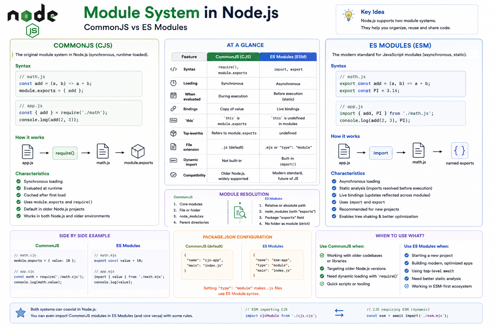

As your Node.js application grows, keeping everything in one file quickly becomes impossible.

Imagine writing your entire backend...

* Authentication
* Database
* Routes
* Controllers
* Utilities

...all inside `index.js`.

😵 That would be a nightmare.

That's why JavaScript has **Modules**.

And in Node.js, there are **two module systems**:

📦 **CommonJS (CJS)**

⚡ **ES Modules (ESM)**

Let's understand the differences and when to use each. 👇

---

# What is a Module?

A **module** is simply a file that contains reusable code.

Instead of writing everything in one file, you split your application into smaller pieces.

Example:

```text id="q4m7zk"
auth.js

database.js

user.js

server.js
```

Each file has one responsibility.

This makes your application:

✅ Easier to maintain

✅ Easier to test

✅ Easier to reuse

---

# CommonJS (CJS)

CommonJS was the original module system used by Node.js.

It uses:

```javascript id="r8p2wx"
require()
```

to import modules.

and

```javascript id="v3n9jc"
module.exports
```

to export them.

Example:

```javascript id="h6k4mt"
// math.js

function add(a, b) {
  return a + b;
}

module.exports = { add };
```

Importing:

```javascript id="g7q5lr"
const { add } = require("./math");

console.log(add(2, 3));
```

This syntax is still widely used in existing Node.js projects.

---

# ES Modules (ESM)

ES Modules are the official JavaScript standard.

They use:

```javascript id="m5v2ka"
export
```

and

```javascript id="u1r8zf"
import
```

Example:

```javascript id="n9c3qp"
// math.js

export function add(a, b) {
  return a + b;
}
```

Import:

```javascript id="w2x6jd"
import { add } from "./math.js";

console.log(add(2, 3));
```

This syntax is now common in modern Node.js applications, browsers, and frontend frameworks.

---

# How They Work

### CommonJS

```text id="k8f4yw"
require()
      │
      ▼
Load Module
      │
      ▼
Execute Module
      │
      ▼
Return exports
```

Modules are loaded when `require()` is executed.

---

### ES Modules

```text id="b5n7qx"
Parse Imports
      │
      ▼
Resolve Dependencies
      │
      ▼
Execute Modules
```

Imports are resolved before execution begins, allowing tools and runtimes to analyze dependencies more effectively.

---

# Syntax Comparison

### CommonJS

```javascript id="e3z8tr"
const fs = require("fs");

module.exports = app;
```

---

### ES Modules

```javascript id="p7m4cv"
import fs from "node:fs";

export default app;
```

Cleaner and closer to the JavaScript standard.

---

# Named Export vs Default Export

### Named Export

```javascript id="x6k2nj"
export const add = () => {};

export const sub = () => {};
```

Import:

```javascript id="d4q9hy"
import {
  add,
  sub,
} from "./math.js";
```

---

### Default Export

```javascript id="t9w3bp"
export default function App() {}
```

Import:

```javascript id="y8m6kl"
import App from "./App.js";
```

A module can have multiple named exports but only one default export.

---

# CommonJS vs ES Modules

| Feature   | CommonJS                             | ES Modules                              |
| --------- | ------------------------------------ | --------------------------------------- |
| Import    | `require()`                          | `import`                                |
| Export    | `module.exports`                     | `export`                                |
| Standard  | Node.js legacy module system         | Official JavaScript standard            |
| Loading   | Runtime                              | Static (resolved before execution)      |
| File Type | `.js` (default in CommonJS projects) | `.mjs` or `.js` with `"type": "module"` |

---

# How to Enable ES Modules

Option 1:

Add to `package.json`:

```json id="h1v7sx"
{
  "type": "module"
}
```

Now `.js` files use ES Module syntax.

---

Option 2:

Use:

```text id="c3r5mn"
.mjs
```

file extension.

---

# Can They Work Together?

Yes—but there are some interoperability rules.

For example:

An ES Module can dynamically import a CommonJS module.

A CommonJS module cannot synchronously `require()` an ES Module. Instead, it must use the asynchronous `import()` function.

During migration, it's common to see both systems in the same project.

---

# Which One Should You Use?

### Use CommonJS if:

✅ Maintaining older projects

✅ Working with legacy codebases

✅ Using libraries that still rely on CJS

---

### Use ES Modules if:

✅ Starting a new project

✅ Building modern applications

✅ Sharing code with frontend projects

✅ Following the current JavaScript standard

Today, ES Modules are generally the recommended choice for new Node.js applications.

---

# Common Mistakes

❌ Mixing `require()` and `import` without understanding module type.

❌ Forgetting to set `"type": "module"` when using ESM syntax.

❌ Omitting the file extension in local ES Module imports (for example, `./math.js`).

❌ Confusing default exports with named exports.

---

# Best Practices

✅ Use ES Modules for new projects.

✅ Keep one module focused on one responsibility.

✅ Use named exports when exporting multiple utilities.

✅ Use default exports only when a module has one primary export.

✅ Avoid mixing module systems unless necessary.

---

# A Simple Way to Remember

📦 **CommonJS**

➡️ `require()` + `module.exports`

➡️ Traditional Node.js module system.

---

⚡ **ES Modules**

➡️ `import` + `export`

➡️ Modern JavaScript standard.

Think of modules like LEGO bricks.

Instead of building one giant block, you create small reusable pieces that fit together to build scalable applications.

That's exactly what the Node.js module system helps you do.

Which module system are you using in your projects today?

🔹 CommonJS

🔹 ES Modules

🔹 Both

👇 Let me know!

#NodeJS #JavaScript #ESModules #CommonJS #Backend #WebDevelopment #Programming #SoftwareEngineering #NodeInternals #SystemDesign


