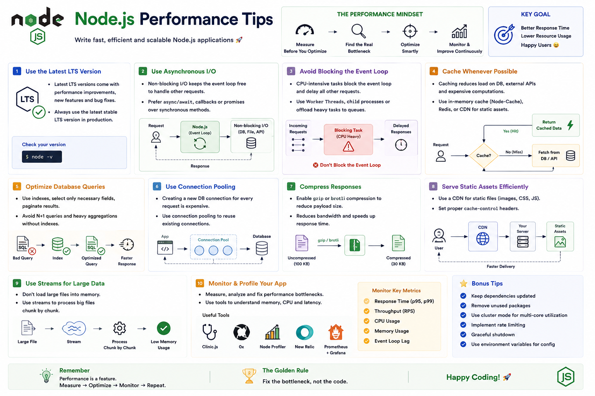

Most Node.js performance problems aren't caused by Node.js itself.

They're caused by **how we write our code.**

A fast backend isn't just about choosing the right framework—it's about making smart engineering decisions.

Here are some practical **Node.js Performance Tips** that can make a real difference. 🚀

---

# 1️⃣ Don't Block the Event Loop

Node.js uses a **single-threaded Event Loop**.

If one task blocks it, every other request has to wait.

Avoid:

❌ Heavy CPU-intensive computations

❌ Large synchronous operations

Instead:

✅ Use asynchronous APIs

✅ Offload CPU-heavy work to Worker Threads

---

# 2️⃣ Prefer Asynchronous APIs

Avoid:

```javascript id="x8m3pq"
fs.readFileSync(
  "data.txt"
);
```

Use:

```javascript id="r4v7kn"
await fs.readFile(
  "data.txt"
);
```

Asynchronous operations keep your server responsive and allow it to handle other requests while waiting for I/O.

---

# 3️⃣ Use Streams for Large Files

Avoid loading huge files into memory.

Instead of:

```javascript id="k9p2tx"
fs.readFile();
```

Use:

```javascript id="n5q8mr"
fs.createReadStream();
```

Benefits:

✅ Lower memory usage

✅ Faster processing

✅ Better scalability

---

# 4️⃣ Optimize Database Queries

Your database is often the real bottleneck.

Best practices:

✅ Create proper indexes

✅ Fetch only the columns you need

✅ Use pagination

✅ Avoid unnecessary queries

Even the fastest Node.js server can't compensate for slow database queries.

---

# 5️⃣ Cache Frequently Used Data

Avoid hitting your database for every request.

Use caching for:

📦 Frequently accessed data

📊 Expensive calculations

🌐 External API responses

Popular choices include in-memory caches and distributed caches like Redis.

---

# 6️⃣ Enable Compression

Compress HTTP responses before sending them.

Benefits:

✅ Smaller payloads

✅ Faster downloads

✅ Lower bandwidth usage

Middleware such as `compression` can help enable gzip or Brotli compression.

---

# 7️⃣ Reuse Database Connections

Creating a new database connection for every request is expensive.

Instead:

✅ Use connection pooling.

Most database drivers support pooling out of the box.

---

# 8️⃣ Use Environment Variables

Avoid hardcoding values.

Store configuration in:

```text id="f6m4zy"
.env
```

Examples:

* Database URLs
* API Keys
* Secrets

This improves security and makes deployments easier.

---

# 9️⃣ Handle Errors Properly

Unhandled errors can crash your application or leave it in an inconsistent state.

Use:

✅ Global error handlers

✅ Proper logging

✅ Graceful shutdown

A stable application is often more valuable than a slightly faster one.

---

# 🔟 Monitor Your Application

You can't optimize what you don't measure.

Track metrics such as:

📈 Response time

💾 Memory usage

⚙️ CPU usage

🔄 Event Loop lag

Monitoring helps you find real bottlenecks instead of guessing.

---

# 1️⃣1️⃣ Keep Dependencies Updated

Newer versions often include:

✅ Performance improvements

✅ Bug fixes

✅ Security patches

Update dependencies carefully and test before deploying to production.

---

# 1️⃣2️⃣ Scale When Needed

If one process isn't enough:

✅ Use the Cluster module to utilize multiple CPU cores.

Or, in modern deployments:

✅ Run multiple application instances behind a load balancer using containers or cloud infrastructure.

Choose the approach that fits your architecture.

---

# Common Mistakes

❌ Using synchronous APIs in production servers.

❌ Loading large files into memory.

❌ Running CPU-intensive work on the Event Loop.

❌ Ignoring slow database queries.

❌ Not monitoring application performance.

❌ Optimizing code without measuring the actual bottleneck.

---

# Best Practices

✅ Keep the Event Loop free.

✅ Write non-blocking code.

✅ Use streams for large data.

✅ Cache wisely.

✅ Optimize database access.

✅ Monitor continuously.

✅ Profile before optimizing.

Remember:

> **Measure → Identify the bottleneck → Optimize → Measure again.**

---

# A Simple Way to Remember

⚡ **Fast I/O** → Use asynchronous APIs.

🌊 **Large Files** → Use streams.

🗄️ **Database** → Optimize queries and indexes.

📦 **Repeated Data** → Cache it.

💾 **Memory** → Monitor usage.

📈 **Performance** → Measure before optimizing.

Think of your Node.js application like a highway.

Adding more lanes won't help if there's an accident blocking the road.

Likewise, adding more servers won't solve performance issues if the real bottleneck is a blocking operation, a slow database query, or inefficient code.

Find the bottleneck first.

Then optimize it.

That's how high-performance Node.js applications are built.

What's the biggest performance issue you've encountered in a Node.js project?

👇 Share your experience!

#NodeJS #JavaScript #Backend #Performance #ExpressJS #WebDevelopment #Programming #SoftwareEngineering #NodeInternals #Scalability


