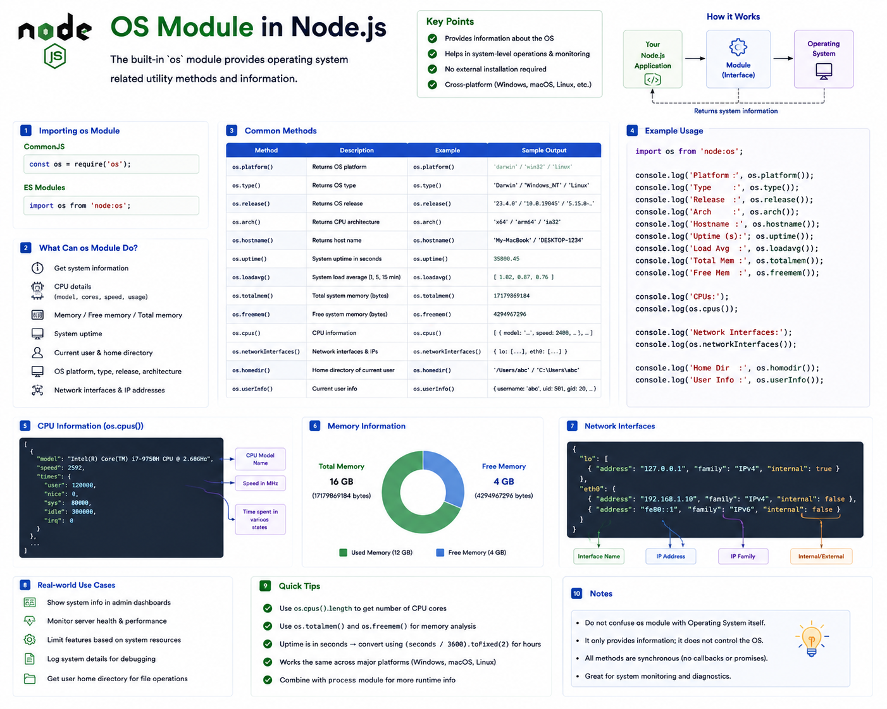

Did you know your Node.js application can ask questions like:

💻 "Which operating system am I running on?"

🧠 "How much RAM is available?"

⚡ "How many CPU cores does this machine have?"

🏠 "What's the current user's home directory?"

Without installing any package?

That's exactly what the built-in **`os` module** is for.

Let's explore it. 👇

---

# What is the `os` Module?

The **`os` module** is a built-in Node.js module that provides information about the **operating system** your application is running on.

It lets your application inspect system details such as:

✅ CPU information

✅ Memory usage

✅ Platform

✅ Hostname

✅ Network interfaces

✅ System uptime

This information is useful for monitoring, diagnostics, logging, and environment-aware applications.

---

# Importing the Module

### CommonJS

```javascript id="g5k8nr"
const os = require("os");
```

---

### ES Modules

```javascript id="r2m9vx"
import os from "node:os";
```

No installation required.

---

# How It Works

When your application calls an `os` method:

```text id="v8p4cz"
Your Code
      │
      ▼
os Module
      │
      ▼
Operating System
      │
      ▼
System Information
```

The `os` module simply exposes information provided by the operating system.

It doesn't modify the OS—it only reads information from it.

---

# Common Methods

## 🖥️ `os.platform()`

Returns the operating system platform.

```javascript id="n3w6jk"
console.log(
  os.platform()
);
```

Possible outputs:

```text id="t6q2fm"
win32

linux

darwin
```

Useful when your application behaves differently on different platforms.

---

## ⚙️ `os.arch()`

Returns the CPU architecture.

```javascript id="h9x4pl"
console.log(
  os.arch()
);
```

Examples:

```text id="u5m7ry"
x64

arm64
```

Helpful for downloads, installers, or native modules.

---

## 🧠 `os.cpus()`

Returns detailed CPU information.

```javascript id="k2r8mv"
console.log(
  os.cpus()
);
```

You'll get details such as:

* CPU model
* Speed
* Core information

To get the number of logical CPU cores:

```javascript id="c8p1tz"
console.log(
  os.cpus().length
);
```

---

## 💾 Memory Information

Total memory:

```javascript id="f7m3qy"
os.totalmem();
```

Available memory:

```javascript id="e4v9kn"
os.freemem();
```

Values are returned in bytes.

A common pattern is converting them to MB or GB before displaying them.

---

## ⏳ `os.uptime()`

Returns how long the operating system has been running.

```javascript id="b6n2jx"
console.log(
  os.uptime()
);
```

Output:

```text id="m1r8vw"
86400
```

(seconds)

Useful for monitoring dashboards.

---

## 🏠 `os.homedir()`

Returns the current user's home directory.

```javascript id="q3k7pf"
console.log(
  os.homedir()
);
```

Example:

```text id="w8v5ny"
/Users/john

or

C:\Users\John
```

---

## 🌐 `os.hostname()`

Returns the machine's hostname.

```javascript id="x5m9zr"
console.log(
  os.hostname()
);
```

Often used for logging and identifying servers in distributed systems.

---

## 🌍 `os.networkInterfaces()`

Returns details about available network interfaces.

```javascript id="z7q4lh"
console.log(
  os.networkInterfaces()
);
```

Useful for:

* Development tools
* Network diagnostics
* Server configuration

---

# Real-World Use Cases

The `os` module is commonly used for:

📊 Monitoring dashboards

🖥️ System diagnostics

📈 Performance logging

⚙️ Deployment scripts

☁️ Server health checks

📝 Environment reporting

It's especially useful in DevOps tools and backend infrastructure.

---

# Combining with `process`

The `os` module is often used alongside the `process` object.

Example:

```javascript id="y1p6mt"
console.log(
  process.pid
);

console.log(
  os.platform()
);

console.log(
  process.version
);
```

Together, they provide a clear picture of both the running Node.js process and the underlying operating system.

---

# Best Practices

✅ Use the `os` module for diagnostics and monitoring.

✅ Convert memory values into readable units before displaying them.

✅ Avoid calling expensive system information repeatedly if it doesn't change often.

✅ Combine it with logging and health-check endpoints.

---

# Common Mistakes

❌ Assuming `os.cpus().length` always equals the number of physical CPU cores—it returns logical CPU cores.

❌ Displaying memory values without converting bytes into MB or GB.

❌ Confusing `os.platform()` with `os.type()`. They return different kinds of operating system information.

❌ Expecting the `os` module to change system settings—it only provides information.

---

# A Simple Way to Remember

🖥️ **`platform()`** → Operating system platform.

⚙️ **`arch()`** → CPU architecture.

🧠 **`cpus()`** → CPU information.

💾 **`totalmem()` / `freemem()`** → Memory details.

⏳ **`uptime()`** → System uptime.

🏠 **`homedir()`** → User's home directory.

🌐 **`networkInterfaces()`** → Network information.

Think of the `os` module as your application's **system dashboard**.

Instead of opening Task Manager, Activity Monitor, or the terminal to inspect your machine, your Node.js application can retrieve the same kinds of information programmatically.

It's a simple module, but it's incredibly useful when building production-ready backend applications and monitoring tools.

Which `os` method have you used the most?

🔹 `platform()`

🔹 `cpus()`

🔹 `totalmem()`

🔹 `hostname()`

👇 Let me know!

#NodeJS #JavaScript #OSModule #Backend #WebDevelopment #Programming #SoftwareEngineering #NodeInternals #ExpressJS #SystemDesign


